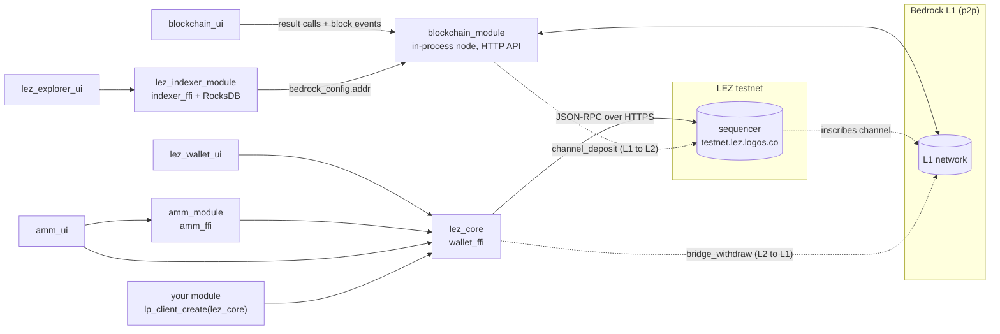

# Stack: Logos Blockchain (Bedrock L1) + Logos Execution Zone (LEZ L2)

**Pinned at:** Basecamp 0.3.1 (`aeb8192`); amm_module 0.1.0 (`145a2ac`), amm_ui 0.1.0 (`41d8c38`), blockchain_module 0.3.0 (`7952ba0`), blockchain_ui 0.3.0 (`c499bf1`), lez_core 0.5.0 (`b89e5d2`), lez_explorer_ui 1.2.0 (`69b7120`), lez_indexer_module 1.2.0 (`b27f3ee`), lez_wallet_ui 1.2.0 (`4e49d9c`), logos_execution_zone 1.0.0 (`01ceef1`).

Nine catalog packages from the `logos-blockchain` org, as shipped in the default catalog
`logos-co/logos-modules-release` (index snapshot 2026-10-01). Three independent chains of
modules sit here; they share no process state and talk to different networks:

1. **L1 node** — `blockchain_module` runs a full Bedrock node in-process; `blockchain_ui` drives it.
2. **LEZ wallet** — `lez_core` wraps the Rust `wallet_ffi` and talks HTTPS to a LEZ *sequencer*
   (default `https://testnet.lez.logos.co`). `lez_wallet_ui`, `amm_module` and `amm_ui` call it.
3. **LEZ read side** — `lez_indexer_module` indexes a LEZ channel by reading an L1 node's HTTP API;
   `lez_explorer_ui` browses it.

`logos_execution_zone` 1.0.0 is in the index but is an accidental re-release of the pre-rename
`lez_core` from June 2026. Do not use it (see [§logos_execution_zone](#logos_execution_zone-superseded)).

Source read at the commits pinned by the catalog (`data/catalog-pins.tsv`); the AMM wrappers were
followed to `logos-blockchain/lez-programs@fb76bec`, and `lez_core`'s Rust library to
`logos-blockchain/logos-execution-zone@411adc8`. The `lez_core` contract below was checked against
`nix build github:logos-blockchain/logos-execution-zone-module/b89e5d2#lidl`.

## Modules

| module | type | role | holds keys? | depends on (manifest) | catalog version |
|---|---|---|---|---|---|
| `blockchain_module` | core | Bedrock L1 node + node wallet, PoW, channel deposits | **yes**: node `keystore.yaml` (ed25519 + zk) | — | 0.3.0 |
| `blockchain_ui` | ui_qml | node onboarding, dashboard, wallet, mining, LEZ channel deposit | no (drives the module; can copy the keystore) | `blockchain_module >=0.3.0` | 0.3.0 |
| `lez_core` | core | LEZ wallet: accounts, transfers, generic/private txs, program deploy, bridge withdraw | **yes**: BIP39-derived key tree in `storage.json` | — | 0.5.0 |
| `lez_wallet_ui` | ui_qml | LEZ wallet app (onboarding, accounts, 6 transfer rails, withdraw) | no (mnemonic shown once) | `lez_core >=0.5.0` | 1.2.0 |
| `lez_indexer_module` | core | LEZ channel indexer (RocksDB), JSON query API | no | — | 1.2.0 |
| `lez_explorer_ui` | ui_qml | LEZ block explorer | no | `lez_indexer_module >=1.2.0` | 1.2.0 |
| `amm_module` | core | Logos DEX logic (quotes, swaps, liquidity) over `lez_core` | no (signs via `lez_core`) | `lez_core` (no range) | 0.1.0 |
| `amm_ui` | ui_qml | Logos DEX app | no | `lez_core`, `amm_module` | 0.1.0 |
| `logos_execution_zone` | core | **superseded** old name of `lez_core` | yes | — | 1.0.0 (linux only) |

Variants: every package above ships `darwin-arm64`, `linux-amd64`, `linux-arm64`; none ships
`windows-x86_64`; `logos_execution_zone` ships linux only. Note the two dependency spellings in
manifests: objects (`{"name","version"}`) and bare strings (AMM) — both are valid LGX.

## How it fits together

---

## `lez_core` — the LEZ wallet module

Repo `logos-blockchain/logos-execution-zone-module@b89e5d2`. A universal (Qt-free) C++ class,
`LEZCoreModule : LogosModuleContext`, over `wallet_ffi` from `logos-execution-zone` rev `411adc8`
("0.3.0 + r0 linking fix") — [flake.nix#L13-L15](https://github.com/logos-blockchain/logos-execution-zone-module/blob/b89e5d24df5babc2490d2e5d47756fb1f33435dd/flake.nix#L13-L15).
API = [src/lez_core_module.h#L31-L129](https://github.com/logos-blockchain/logos-execution-zone-module/blob/b89e5d24df5babc2490d2e5d47756fb1f33435dd/src/lez_core_module.h#L31-L129).
No events. `metadata.json` declares `capabilities: []` and no `concurrency` key.

### The wallet model: one handle per process

`lez_core` holds a single `WalletHandle* walletHandle`
([h#L127-L128](https://github.com/logos-blockchain/logos-execution-zone-module/blob/b89e5d24df5babc2490d2e5d47756fb1f33435dd/src/lez_core_module.h#L127-L128)).
Basecamp loads each core module once, so **every caller in a session shares whichever wallet was
opened first** — the AMM README says so explicitly
([modules/amm/README.md#L66-L72](https://github.com/logos-blockchain/lez-programs/blob/fb76bec03c661e3de2a0bab20fe1a719686a7199/modules/amm/README.md#L66-L72)).
There is no close/switch method. `open` and `create_new` refuse while a wallet is open
([cpp#L1227-L1280](https://github.com/logos-blockchain/logos-execution-zone-module/blob/b89e5d24df5babc2490d2e5d47756fb1f33435dd/src/lez_core_module.cpp#L1227-L1280)).

Known openers and where they put the wallet:

| opener | config / storage | source |
|---|---|---|
| `lez_wallet_ui` | `<wallet_dir()>/config.json`, `storage.json`, `statistics.json` (wallet_dir = `<session>/module_data/lez_core/<instance>/`); remembered in `QSettings("Logos","ExecutionZoneWalletUI")` and auto-opened at UI start | [LEZWalletBackend.cpp#L593-L642](https://github.com/logos-blockchain/logos-execution-zone-wallet-ui/blob/4e49d9cead1732e5c6089690d3eed4b0aff2d0f5/src/LEZWalletBackend.cpp#L593-L642) |
| `amm_ui` | `~/.lee/wallet/wallet_config.json`, `storage.json` (`LEE_WALLET_HOME_DIR` overrides) | [WalletController.cpp#L50-L61](https://github.com/logos-blockchain/lez-programs/blob/fb76bec03c661e3de2a0bab20fe1a719686a7199/apps/shared/wallet/src/WalletController.cpp#L50-L61) |
| any other caller | whatever paths it passes | — |

"Is a wallet already open?" idiom used by the AMM app: `get_sequencer_addr()` non-empty, or
`list_accounts()` non-empty ([LogosWalletProvider.cpp#L334-L341](https://github.com/logos-blockchain/lez-programs/blob/fb76bec03c661e3de2a0bab20fe1a719686a7199/apps/shared/wallet/src/LogosWalletProvider.cpp#L334-L341)).

### Method surface (LIDL @ b89e5d2, version "0.5.0")

Lifecycle / config

| method | returns | notes |
|---|---|---|
| `wallet_dir()` | tstr | host persistence dir, or `"-"` when the host gave none ([cpp#L435-L439](https://github.com/logos-blockchain/logos-execution-zone-module/blob/b89e5d24df5babc2490d2e5d47756fb1f33435dd/src/lez_core_module.cpp#L435-L439)) |
| `create_new(config_path, storage_path, statistics_path, password)` | tstr | the **BIP39 mnemonic**, `""` on failure or if already open. Missing config file is written with the default (sequencer `https://testnet.lez.logos.co`) — [config.rs#L78-L84](https://github.com/logos-blockchain/logos-execution-zone/blob/411adc8fdb3f4c3af64354c4fc26d3e4a6a3d3f4/lez/wallet/src/config.rs#L78-L84) |
| `open(config_path, storage_path, statistics_path)` | int | 0 ok; 99 (`InternalError`) if already open or open failed. No password. |
| `save()` | int | writes `storage.json`. State is in memory until `save()` or a sync |
| `restore_storage(mnemonic, password, depth)` | int | LIDL types `depth` as `any`; the header warns `any` args are silently dropped over QtRO ([h#L84-L89](https://github.com/logos-blockchain/logos-execution-zone-module/blob/b89e5d24df5babc2490d2e5d47756fb1f33435dd/src/lez_core_module.h#L84-L89)) — likely unusable cross-process (unverified) |
| `get_sequencer_addr()` | tstr | `""` when no wallet is open |
| `name()` / `version()` | tstr | `version()` is hard-coded `"0.3.0"` ([cpp#L425-L431](https://github.com/logos-blockchain/logos-execution-zone-module/blob/b89e5d24df5babc2490d2e5d47756fb1f33435dd/src/lez_core_module.cpp#L425-L431)); do not use it for feature detection |

Accounts and reads

| method | returns |
|---|---|
| `create_account_public()` / `create_account_private()` | 64-hex account id, `""` on error |
| `list_accounts()` | `[{"account_id": hex32, "is_public": bool}]` |
| `get_balance(account_id_hex, is_public)` | decimal string of a u128 (lepta), `""` on error |
| `get_account_public(id)` / `get_account_private(id)` | JSON string `{"nonce": hex16, "shards": [{"program": hex32, "data": hex}]}` |
| `get_public_account_key(id)` | hex32 public key |
| `get_private_account_keys(id)` | `{"nullifier_public_key": hex32, "viewing_public_key": hex}` — the **public** key node a recipient hands out; no secrets despite the name |
| `account_id_to_base58(hex)` / `account_id_from_base58(b58)` | tstr |
| `sync_to_block(block_id)` | int FFI code |
| `get_last_synced_block()` / `get_current_block_height()` | int (0 on error; height is a sequencer round-trip) |
| `poll_transaction_status(tx_hash_hex)` | bool found |
| labels: `check_label_available(label)` → bool; `add_label(label, id, is_private)` → int; `resolve_label(label)` → `"Public/<hex>"` \| `"Private/<hex>"` \| `""`; `get_all_labels_for_account(id, is_private)` → `[tstr]` | |

Value-moving calls — all return the envelope `{"success": bool, "tx_hash": str, "error": str}`
([cpp#L145-L152](https://github.com/logos-blockchain/logos-execution-zone-module/blob/b89e5d24df5babc2490d2e5d47756fb1f33435dd/src/lez_core_module.cpp#L145-L152)).
`amount_le16_hex` is exactly 32 hex chars: a u128 **little-endian** in lepta (1 LGO = 10^9 lepta,
per [LEZWalletBackend.cpp#L42-L89](https://github.com/logos-blockchain/logos-execution-zone-wallet-ui/blob/4e49d9cead1732e5c6089690d3eed4b0aff2d0f5/src/LEZWalletBackend.cpp#L42-L89)).

| method | from → to |
|---|---|
| `transfer_public(from_hex, to_hex, amt)` | public → public. A fresh public account is claimed by its first funded transfer ([h#L71-L72](https://github.com/logos-blockchain/logos-execution-zone-module/blob/b89e5d24df5babc2490d2e5d47756fb1f33435dd/src/lez_core_module.h#L71-L72)) |
| `transfer_shielded(from_hex, to_keys_json, amt)` | public → someone's private key node (`to_keys_json` = `get_private_account_keys` shape) |
| `transfer_shielded_owned(from_hex, to_hex, amt)` | public → own private account |
| `transfer_deshielded(from_hex, to_hex, amt)` | private → public |
| `transfer_private(from_hex, to_keys_json, amt)` | private → someone's key node |
| `transfer_private_owned(from_hex, to_hex, amt)` | private → own private account |
| `bridge_withdraw(from_hex, bedrock_account_pk_hex, amount: uint)` | LEZ → L1 Bedrock; amount is a **u64**, not le16 hex |

Generic / program calls ([h#L80-L111](https://github.com/logos-blockchain/logos-execution-zone-module/blob/b89e5d24df5babc2490d2e5d47756fb1f33435dd/src/lez_core_module.h#L80-L111)) return
`{"success","tx_hash","secrets": [hex32...],"error"}`:

- `send_generic_public_transaction(account_ids: [tstr], signing_requirements: [bool], instruction: bstr, program_id_hex, payer_account_id_hex, shard_program_account_ids_hex: [tstr])` — `instruction` is Borsh bytes; `payer` `""` = self-pay from the first funded signer; shard list empty or one entry per account.
- `send_generic_private_transaction(account_ids, instruction: bstr, program_elf: bstr, program_kind_json, program_dependencies, dependency_kinds_json: [tstr], shard_program_account_ids_hex)` — `program_kind_json` = `{"kind":"disclosed"|"shadow"|"undisclosed","account_id":hex,...}`; `program_dependencies` is `any` in LIDL (same QtRO caveat as `restore_storage`).
- `send_program_deployment_transaction(header_account_id_hex, segment_account_ids_hex: [tstr], program_elf: bstr, immutable: bool, payer_account_id_hex)` — one segment account per 96 KiB; payer must be funded or the sequencer answers `PayerCannotFund`.
- `token_elf()`, `amm_elf()`, `ata_elf()` → `bstr` of the built-in program ELFs.

FFI error codes (`int` returns): 0 Success, 1 NullPointer (e.g. no wallet open), 3 WalletNotInitialized,
4 ConfigError, 5 StorageError, 6 NetworkError, 9 InsufficientFunds, 10 InvalidAccountId, 13 SyncError,
18 PayerCannotFund, 99 InternalError — [error.rs#L11-L51](https://github.com/logos-blockchain/logos-execution-zone/blob/411adc8fdb3f4c3af64354c4fc26d3e4a6a3d3f4/lez/wallet-ffi/src/error.rs#L11-L51).

### Private payments (how receiving works)

A recipient publishes its **key node** (`nullifier_public_key`, `viewing_public_key`). The sender's
`lez_core` picks a **random identifier** for the destination account
([cpp#L220-L230](https://github.com/logos-blockchain/logos-execution-zone-module/blob/b89e5d24df5babc2490d2e5d47756fb1f33435dd/src/lez_core_module.cpp#L220-L230), [L678-L683](https://github.com/logos-blockchain/logos-execution-zone-module/blob/b89e5d24df5babc2490d2e5d47756fb1f33435dd/src/lez_core_module.cpp#L678-L683)),
so every payment lands in a *new* private account the recipient discovers by `sync_to_block` and
then `list_accounts`. Polling `get_balance` on the account you created and published shows nothing.
A shield to your own key node also lands in a discovered account. (Confirmed on testnet in the
owner's Muster labbook, 2026-08/09.)

### Keys and trust boundary

- Key material is a BIP39-derived key tree inside the `lez_core` host process, persisted by `save()`
  into `storage.json` as **plain serde JSON**: the `password` argument is ignored upstream
  ("TODO: Use password for storage encryption" — [storage.rs#L32-L35](https://github.com/logos-blockchain/logos-execution-zone/blob/411adc8fdb3f4c3af64354c4fc26d3e4a6a3d3f4/lez/wallet/src/storage.rs#L32-L35), [L88-L90](https://github.com/logos-blockchain/logos-execution-zone/blob/411adc8fdb3f4c3af64354c4fc26d3e4a6a3d3f4/lez/wallet/src/storage.rs#L88-L90)). Anyone who can read `storage.json` holds the funds.
- No method exports secret keys; the mnemonic leaves the module once, as `create_new`'s return value.
  No import-key method is exposed (the FFI has `wallet_ffi_import_*`; the module does not wrap it).
- **Every spending method is ungated.** There is no per-call consent, per-caller account scope or
  spending limit. In Basecamp 0.3.1 inter-module access enforcement is **off by default**, so any
  loaded module can call `transfer_*`, `send_generic_*`, `bridge_withdraw` on the shared wallet
  (see `stacks/platform.md` §Capabilities). Even under `--access-policy enforce`, any module that
  declares `lez_core` as a dependency gets full spend authority.
- Calls serialize (no `concurrency` key; single-threaded dispatch is assumed — unverified default).
  A proving call blocks every other `lez_core` call. Measured by Muster on testnet (lez_core 0.4.0):
  6–8 min per shielded/private transfer, ~10 cores and ~9 GB RSS.

### Using `lez_core` from another module

1. **Declare it**: `"dependencies": [{"name": "lez_core", "version": ">=0.5.0"}]`. Needed for load
   order, for `--access-policy enforce`, and for typed-client generation (flake input must be named
   `lez_core`).
2. **Pick a transport.**
   - Universal C++ module: `modules().lez_core.get_balance(id, true)` (generated wrapper).
   - Qt UI backend: `m_logos->lez_core.*`; for anything that proves use
     `getClient("lez_core")->invokeRemoteMethod("lez_core", "transfer_private", args, Timeout(-1))`
     as the wallet UI does ([LEZWalletBackend.cpp#L499-L502](https://github.com/logos-blockchain/logos-execution-zone-wallet-ui/blob/4e49d9cead1732e5c6089690d3eed4b0aff2d0f5/src/LEZWalletBackend.cpp#L499-L502)), or the generated `*Async(..., cb, Timeout(ms))`.
   - C ABI (Nim/Rust/C — e.g. Muster): `lp_client_create("lez_core", "<your_module>", NULL, NULL)`,
     then `lp_invoke(c, "get_balance", "[\"<hex>\", true]", 15000, &res, &err)`; args are a JSON
     array, positional. `tstr` results arrive JSON-encoded (unwrap the string); `int` as a number.
     `timeout_ms <= 0` means the 20 s default ([logos_protocol.cpp#L85](https://github.com/logos-co/logos-protocol/blob/8bbc027c99505c3c2f043265f8c1ae8ff899bdff/cpp/logos_protocol.cpp#L85)), which a proof never fits — use `lp_invoke_async` with ~900 s ([logos_protocol.h#L453-L506](https://github.com/logos-co/logos-protocol/blob/8bbc027c99505c3c2f043265f8c1ae8ff899bdff/cpp/logos_protocol.h#L453-L506)). How `bstr` args are JSON-encoded on this path is unverified.
3. **Adopt, don't clobber.** Probe `get_sequencer_addr()` / `list_accounts()` first. If a wallet is
   open, it is the session's shared wallet (possibly the user's LEZ Wallet UI wallet) — use it or
   refuse. An "`open()` failed, so `create_new()`" fallback is wrong here: `open` returns 99 *because*
   a wallet is open, `create_new` then returns `""`, and the caller ends up silently operating on
   (and writing labels into) someone else's wallet.
4. **Check all four failure shapes**: transport error (`CallError`/`rc != LP_OK`); `""` or `0` from
   reads; non-zero `int`; and the JSON envelope with `"success": false` (non-empty, so an emptiness
   check passes it). The reason is only in the host's stderr (`[lez_core] …`), not in the return.
   An **unknown method returns bare `null`**, not an error ([logos_protocol.h#L484-L497](https://github.com/logos-co/logos-protocol/blob/8bbc027c99505c3c2f043265f8c1ae8ff899bdff/cpp/logos_protocol.h#L484-L497)).
5. **`add_label` always returns 0** after a wallet refusal (it logs and returns `SUCCESS`,
   [cpp#L1315-L1332](https://github.com/logos-blockchain/logos-execution-zone-module/blob/b89e5d24df5babc2490d2e5d47756fb1f33435dd/src/lez_core_module.cpp#L1315-L1332)). Confirm with `resolve_label`.
6. **Warm up.** The first cross-module call can race the capability-token handshake and come back
   as a default value (`0` from `open` is indistinguishable from success). Retry `version()` until
   non-empty before trusting results ([LEZWalletBackend.cpp#L268-L282](https://github.com/logos-blockchain/logos-execution-zone-wallet-ui/blob/4e49d9cead1732e5c6089690d3eed4b0aff2d0f5/src/LEZWalletBackend.cpp#L268-L282)).
7. **Persist and pace.** Call `save()` after every account creation, funding and landed transfer.
   A fresh wallet syncs from block 0 and `storage.json` is rewritten per block (observed in
   Muster's testnet runs: ~2 min from 0 to a ~29k tip); walk
   `sync_to_block` in bounded steps (wallet UI: 100; Muster: 250) and never while a proof runs.
8. **Version drift.** Removed in 3716f57 (2026-09-07, before 0.4.1): `register_public_account`,
   `register_private_account`, `claim_pinata*`. `send_generic_public_transaction` grew `payer` and
   shard arguments; `create_new`/`open` grew `statistics_path` earlier. Code written against ≤0.4.0
   calls methods that now answer `null`.

### Config & persistence

- Wallet config JSON (`WalletConfig`): `{"sequencers": [{"sequencer_addr": url, "basic_auth": null}],
  "seq_poll_timeout": "30s", "seq_tx_poll_max_blocks": 15, "seq_poll_max_retries": 10,
  "seq_block_poll_max_amount": 100}` — the wallet UI writes this shape to override the sequencer
  ([LEZWalletBackend.cpp#L567-L591](https://github.com/logos-blockchain/logos-execution-zone-wallet-ui/blob/4e49d9cead1732e5c6089690d3eed4b0aff2d0f5/src/LEZWalletBackend.cpp#L567-L591)). A flat `{"sequencer_addr": ...}` does not parse and makes `create_new` return `""`. Safest: pass a non-existent config path and let the wallet write its default.
- Local sequencer in the UI is `http://127.0.0.1:3040`.
- `config/testnet.config.yaml` in the repo is an L1 node config, not read by `lez_core` (appears unused).

---

## `lez_wallet_ui`

Repo `logos-blockchain/logos-execution-zone-wallet-ui@4e49d9c`. QtRO backend contract
[src/LEZWalletBackend.rep](https://github.com/logos-blockchain/logos-execution-zone-wallet-ui/blob/4e49d9cead1732e5c6089690d3eed4b0aff2d0f5/src/LEZWalletBackend.rep#L1-L39):
`createNew(password, sequencerAddr)` → `{"success", "mnemonic"|"error"}`, `openExisting(configPath,
storagePath)`, `transferPublic/Private/PrivateOwned/Shielded/ShieldedOwned/Deshielded(from, to,
amountStr)` (amount in LGO decimal string), `bridgeWithdraw`, labels. Refuses to create over an
existing `storage.json`. Saves the wallet on balance refresh and on `aboutToQuit`. No intents.

## `logos_execution_zone` (superseded)

The index lists `logos_execution_zone` 1.0.0 (released 2026-09-30T09:04Z, `manifestVersion` 0.2.0,
linux only, plugin `logos_execution_zone_plugin.so`) with no submodule of that name. It is
**the June 2026 build of this same repo under its old module name**:

- `logos-execution-zone-module` was named `lez_wallet_module` → `logos_execution_zone` (1.0.0,
  class `LogosExecutionZoneWalletModule`, LEZ `lssa` v0.1.2) → renamed `lez_core` in 01c6f40
  (2026-06-30).
- Catalog commit [0b28c75](https://github.com/logos-co/logos-modules-release/commit/0b28c75140bbe713b7bf69fe1ceb7a649478add8)
  (2026-09-30 08:10Z, "Update blockchain module to 0.3.0") changed 11 submodule pointers,
  including moving this one back from `bbe150a` to `01ceef1` (2026-06-19,
  `"name": "logos_execution_zone", "version": "1.0.0"`).
  The release `logos_execution_zone-v1.0.0` was created two minutes later; [4a5462c](https://github.com/logos-co/logos-modules-release/commit/4a5462c7571c1c732d78fbf72146a7deaeaaa928)
  (09:39Z, "rebump the reverted LEZ core modules") restored the pointer, but the release stayed.

Its API is the pre-rename surface (`claim_pinata*`, `register_*`, `create_new(config, storage,
password) -> int`, no generic txs) against an older LEZ; nothing in the catalog depends on it.
Treat it as superseded by `lez_core`; never declare a dependency on it.

---

## `blockchain_module` — Bedrock L1 node

Repo `logos-blockchain/logos-blockchain-module@7952ba0`, wraps `logos-blockchain` ref `0.3.0`.
API = [src/logos_blockchain_module.h#L18-L320](https://github.com/logos-blockchain/logos-blockchain-module/blob/7952ba0cc9c519e1d5198b27de425c872d23b9fc/src/logos_blockchain_module.h#L18-L320).
Every method returns LIDL `result` = `{"success": bool, "value": any, "error": str}`; JSON payloads
are usually a JSON **string** inside `value`. The committed `blockchain_module.lidl` is stale
(`version "0.0.999"`, missing `subscribe_to_*`, `merge_user_config`, `pow_configure`,
`read_accounts`, `read_pow_config`); build `#lidl` for the real contract.

Flow:

1. `generate_user_config(json_args)` → `value` = path written. Keys: `initial_peers: [multiaddr]`,
   `output`, `net_port`, `blend_port`, `http_addr`, `external_address`, `state_path`, `storage_path`,
   `logs_path`, `skip_ibd`, `log_filter`, `kms_file`, and `use_persistence_paths: true` (routes
   config/state/logs under the instance persistence dir) —
   [cpp#L189-L290](https://github.com/logos-blockchain/logos-blockchain-module/blob/7952ba0cc9c519e1d5198b27de425c872d23b9fc/src/logos_blockchain_module.cpp#L189-L290), [L545-L623](https://github.com/logos-blockchain/logos-blockchain-module/blob/7952ba0cc9c519e1d5198b27de425c872d23b9fc/src/logos_blockchain_module.cpp#L545-L623). The peer list is not defaulted: `blockchain_ui` passes the `bootstrap_peers` from its own `metadata.json`.
2. `start(config_path, deployment)` (empty `config_path` → env `LB_CONFIG_PATH`) starts the node and
   subscribes all three streams ([cpp#L625-L669](https://github.com/logos-blockchain/logos-blockchain-module/blob/7952ba0cc9c519e1d5198b27de425c872d23b9fc/src/logos_blockchain_module.cpp#L625-L669)). `stop()`, `does_state_exist()`, `purge_state()`.
3. Reads: `get_cryptarchia_info`, `get_block(header_id_hex)`, `get_blocks(from_slot, to_slot)`,
   `get_transaction`, `get_block_events`, `get_time_info`, `get_network_info`, `get_chain_id`,
   `get_channel_state(channel_id_hex)`, `blend_info`, `get_peer_id(config_path)`.
4. Wallet (node keys): `wallet_get_balance(address_hex)`, `wallet_get_known_addresses()`,
   `wallet_get_notes(addr, tip)` → `{"tip", "notes": [{"id","value"}]}`,
   `wallet_transfer_funds(change_pk, sender_addresses: [tstr], recipient, amount: decimal u64, tip)`
   → tx hash, `wallet_fund_tx(request_json)`, `submit_signed_transaction(signed_tx_json)`,
   `leader_claim()`, `wallet_get_claimable_vouchers()`, `wallet_get_leader_aged_notes(tip)`.
5. L1→LEZ deposit: `channel_deposit(channel_id_hex, funding_pk, amount, metadata_hex, tip)` or
   `channel_deposit_with_notes(...)`.
6. PoW: `pow_start/stop_mining`, `pow_start/stop_auto_claim`, `pow_claim(addr)`,
   `pow_claimable_rewards`, `pow_status`, static `pow_configure(config_path, json)`.
7. Keystore (static, file-level): `generate_key(cfg, keystore, "ed25519"|"zk", title)`,
   `add_key(..., key_hex, title)`, `remove_key`, `read_accounts(config_path)`.

Events ([h#L284-L301](https://github.com/logos-blockchain/logos-blockchain-module/blob/7952ba0cc9c519e1d5198b27de425c872d23b9fc/src/logos_blockchain_module.h#L284-L301)):
`newBlock(blockJson)`, `processedBlock(eventJson)` (same schema as HTTP `/cryptarchia/blocks/stream`),
`libBlock(blockInfoJson)`. A literal `null` payload means the stream ended; call `subscribe_to_*`
again (not from inside the event handler — the node runtime panics). Blocks missed while down are
lost; backfill with `get_blocks`.

Trust: the node's wallet signs with keys from `keystore.yaml` next to the user config
(`blockchain_ui` locates and backs it up, [BlockchainBackend.cpp#L1398-L1421](https://github.com/logos-blockchain/logos-blockchain-ui/blob/c499bf195d07cc8a00279a367826139820cd19c1/src/BlockchainBackend.cpp#L1398-L1421)).
`wallet_transfer_funds`, `channel_deposit*`, `pow_claim`, `add_key`/`remove_key` are ungated —
any module that can call `blockchain_module` can move node funds or rewrite a keystore at a path it
names. The node also serves an HTTP API at `http_addr` (`localhost:8080` in `blockchain_ui`'s
README); that is what `lez_indexer_module` reads.

A Rust client crate (`rust-client/`, `BlockchainModuleClient`) and a Zone SDK backend
(`zone-sdk/`, `NodeModuleClient`) for consumers live in the same repo.

## `blockchain_ui`

Repo `logos-blockchain/logos-blockchain-ui@c499bf1`. Contract [src/BlockchainBackend.rep](https://github.com/logos-blockchain/logos-blockchain-ui/blob/c499bf195d07cc8a00279a367826139820cd19c1/src/BlockchainBackend.rep#L1-L254).
`metadata.json` carries `bootstrap_peers` (4 testnet multiaddrs) and `lez_channel_id`
`0101…01` used to pre-fill the LEZ deposit view
([metadata.json#L12-L18](https://github.com/logos-blockchain/logos-blockchain-ui/blob/c499bf195d07cc8a00279a367826139820cd19c1/metadata.json#L12-L18)).
Persists UI state in `QSettings("Logos","BlockchainUI")`. Calls `modules_state.module_record`
for the node PID without declaring it ([BlockchainBackend.cpp#L1297-L1340](https://github.com/logos-blockchain/logos-blockchain-ui/blob/c499bf195d07cc8a00279a367826139820cd19c1/src/BlockchainBackend.cpp#L1297-L1340)).

---

## `lez_indexer_module` + `lez_explorer_ui`

Indexer: `logos-blockchain/lez-indexer-module@b27f3ee`, `indexer_ffi` from the same LEZ rev `411adc8`.
API [src/lez_indexer_module_impl.h#L25-L93](https://github.com/logos-blockchain/lez-indexer-module/blob/b27f3ee7a6fad18ddc0e022fbada81d8514e0d54/src/lez_indexer_module_impl.h#L25-L93):

- `start_indexer(config_path)` → int (0 ok, else `OperationStatus`; path must be **absolute**;
  idempotent). Not started on load. `stop_indexer()`, `reset_storage(config_path)` (deletes
  `<persistence>/rocksdb-<channel_id>`).
- Queries return compact JSON strings, `""` = not found; ids/hashes hex32, numbers as decimal
  strings: `getStatus()` → `{state: Starting|Syncing|CaughtUp|Error|Stalled, last_error,
  indexed_block_id, stall_reason}`, `getLastFinalizedBlockId()`, `getBlockById(id)`,
  `getBlockByHash(hash)`, `getBlocks(before, limit)` (`before=""` = tip), `getTransaction(hash)`,
  `getAccount(id)` (Base58 or hex; payload omits the id), `getTransactionsByAccount(id, offset, limit)`.
- Config ([config/indexer_config.json](https://github.com/logos-blockchain/lez-indexer-module/blob/b27f3ee7a6fad18ddc0e022fbada81d8514e0d54/config/indexer_config.json)):
  `bedrock_config.addr` (an **L1 node's HTTP API**, default `http://localhost:8080`), `channel_id`,
  `consensus_info_polling_interval`, `allow_chain_reset`. No events; poll.

Explorer: `logos-blockchain/lez-explorer-ui@69b7120`. Writes its own config file, (re)starts the
indexer, polls every 2 s; Settings page edits the JSON. Default channel `0303…03`
([lez_explorer_ui_backend.cpp#L62-L69](https://github.com/logos-blockchain/lez-explorer-ui/blob/69b7120baf723d74be65aa8c12c865d94f742966/src/lez_explorer_ui_backend.cpp#L62-L69)).
Declares `uses: [{"intent": "basecamp.apps.launch"}]`. No keys anywhere in this pair.

---

## `amm_module` + `amm_ui` (Logos DEX)

The catalog repos `logos-amm-module@145a2ac` / `logos-amm-ui-module@41d8c38` contain only a
`flake.nix` + `metadata.json` re-exporting `lez-programs@fb76bec` outputs
([flake.nix](https://github.com/logos-blockchain/logos-amm-module/blob/145a2acaa65e83650bc7fb35415b3da08baac6ca/flake.nix)). Real source:
[modules/amm](https://github.com/logos-blockchain/lez-programs/tree/fb76bec03c661e3de2a0bab20fe1a719686a7199/modules/amm) and
[apps/amm](https://github.com/logos-blockchain/lez-programs/tree/fb76bec03c661e3de2a0bab20fe1a719686a7199/apps/amm).

`amm_module` API ([amm_module_impl.h#L28-L294](https://github.com/logos-blockchain/lez-programs/blob/fb76bec03c661e3de2a0bab20fe1a719686a7199/modules/amm/src/amm_module_impl.h#L28-L294)):
reads `resolvePoolAccount(defA, defB)`, `configAccount()`, `feeTiers()` → `[1,5,30,100]`,
`tokenHoldings(walletOpen)`, `resolveTokens({tokenIds}, walletOpen)`; quotes
`swapExactInQuote/OutQuote(in, out, amount, slippageBps)`, `createPoolQuote`, `addLiquidityQuote`,
`removeLiquidityQuote`; submits `swapExactInput/Output(...)` → bare tx hash or `""`,
`createPool/addLiquidity/removeLiquidity/syncReserves/transferOwnership/createPriceObservations/
createOraclePriceAccount(request)` → `{status:"ok"|"error", error, transactionId}`;
`setAmmProgramId({...})`. Amounts are JSON integers or decimal strings (floats rejected). The
program id comes from env `AMM_PROGRAM_BIN` (path to `amm.bin`) on the **host process**, or from
`setAmmProgramId` (the UI sets it from a network registry URL).

Chain I/O goes through `lez_core`: `account_id_from_base58`, `get_account_public`, `list_accounts`,
`send_generic_public_transaction`. Signing therefore uses the shared `lez_core` wallet.
`amm_ui` keeps its wallet at `~/.lee/wallet/` and adopts an already-open shared wallet.

**Compatibility warning.** `lez-programs` builds against `lez_core` branch `byte-string-fix`
(lock rev `b60be46`, `metadata.version` 0.4.0, LEZ v0.2.2) — [flake.nix#L37-L50](https://github.com/logos-blockchain/lez-programs/blob/fb76bec03c661e3de2a0bab20fe1a719686a7199/flake.nix#L37-L50).
There `send_generic_public_transaction` takes **4** args; `amm_module` calls it with 4
([amm_module_impl.cpp#L470-L471](https://github.com/logos-blockchain/lez-programs/blob/fb76bec03c661e3de2a0bab20fe1a719686a7199/modules/amm/src/amm_module_impl.cpp#L470-L471)).
Catalog `lez_core` 0.5.0 takes **6** and links LEZ 0.3.0. `amm_module` 0.1.0 (2026-09-03) declares
`lez_core` with no version range, so installs alongside 0.5.0 succeed; whether submits work
against it is **unverified and unlikely**.

---

## Trust boundaries (summary)

| asset | held by | who can use it (Basecamp 0.3.1 defaults) |
|---|---|---|
| LEZ keys (plaintext `storage.json`) | `lez_core` process | any loaded module, via `transfer_*` / `send_*` / `bridge_withdraw` |
| L1 node keys (`keystore.yaml`) | `blockchain_module` process | any loaded module, via `wallet_*`, `channel_deposit*`, `pow_claim`, keystore methods |
| LEZ mnemonic | returned once by `lez_core.create_new` | the caller (wallet UI shows it as a recovery phrase) |
| indexer DB | `lez_indexer_module` | read-only queries; `reset_storage` deletes it |

## Events

| module | event | payload |
|---|---|---|
| `blockchain_module` | `newBlock`, `processedBlock`, `libBlock` | one JSON string; `null` = stream ended |
| `lez_core`, `lez_indexer_module`, `amm_module` | — | none; poll |

## Gotchas & open questions

- **Which channel is LEZ testnet?** Three values ship: `blockchain_ui` `lez_channel_id` `0101…01`,
  explorer default `0303…03` (changed 2026-10-01, catalog commit 3ba43d6), indexer sample `8301…01`.
  Unverified which matches the sequencer at `testnet.lez.logos.co`.
- Basecamp dev (`nix build`) builds only install `-dev` variants; catalog packages are portable
  variants — test catalog installs on a portable/distributed Basecamp (see `stacks/platform.md`).
- `lez-module/doctests/*.yaml` still says `logos_execution_zone`; the doc-test text is stale.
- `restore_storage` and `send_generic_private_transaction` carry LIDL `any` arguments; whether they
  survive QtRO / `lp_*` is unverified.
- Recipient identifiers: `wallet_ffi_resolve_private_account` reports identifier 0 for every owned
  private account; do not read meaning into it (Muster labbook §9).
- `lez_core` has no events: wallet changes made by another caller (another app syncing, creating
  accounts) are invisible until you re-read `list_accounts`.
