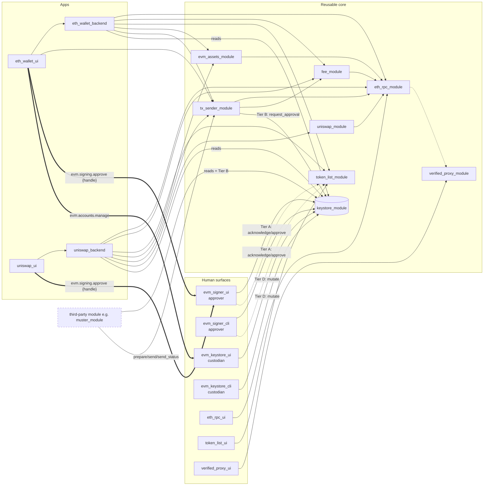

# EVM wallet stack

**Pinned at:** Basecamp 0.3.1 (`aeb8192`); eth_rpc_module 0.1.0 (`42cc465`), eth_rpc_ui 0.1.0 (`d670fdf`), eth_wallet_backend 0.1.0 (`2866409`), eth_wallet_ui 0.1.0 (`81f8676`), evm_assets_module 0.1.0 (`3235e6b`), evm_keystore_cli 0.1.0 (`47554a1`), evm_keystore_ui 0.1.0 (`4460518`), evm_signer_cli 0.1.0 (`861c2ed`), evm_signer_ui 0.1.0 (`62f89d5`), fee_module 0.1.0 (`5bf49b7`), keystore_module 0.1.0 (`2318c67`), token_list_module 0.1.0 (`213e628`), token_list_ui 0.1.0 (`7fc7ba6`), tx_sender_module 0.1.0 (`7cd2fea`), uniswap_backend 0.1.0 (`b561baa`), uniswap_module 0.1.0 (`cc677c3`), uniswap_ui 0.1.0 (`69caca7`), verified_proxy_module 0.1.3 (`f0cf1f4`), verified_proxy_ui 0.1.0 (`28d4cdd`).

The Ethereum/EVM wallet that Logos Basecamp 0.3.1 offers through its default catalog
(`logos-co/logos-modules-release`). None of these modules ships inside the app. Every one comes
from the catalog: 19 packages, all at `0.1.0` (published 2026-09-28) except `verified_proxy_module`
`0.1.3` (2026-09-29). Every claim below was read at the commit pinned in
`data/catalog-pins.tsv`, not at HEAD. Links go to the source at that commit. The reference list
is at the bottom. **unverified** marks anything not confirmed in code.

## 1. Design in one paragraph

There is **one key holder** (`keystore_module`) and **one transaction sender** (`tx_sender_module`)
per device, and nothing else touches either job. The keystore is a dependency-free leaf with no
network code. It keeps scrypt vaults on disk and has **no unlock, no signer cache, and no
sign-on-demand method**. A signature exists only after a human types the vault password into the
configured **approver** surface (`evm_signer_ui`, or `evm_signer_cli` headless). That surface
gets back a count, never the signatures. Account mutation (create, import, export, delete,
derive) is reserved for the configured **custodian** surface (`evm_keystore_ui` /
`evm_keystore_cli`). Any other module may only *read* accounts and *request* approvals. The
sender owns the device's one nonce ledger, turns a bundle of calls into **one** human decision,
broadcasts through `eth_rpc_module`, and keeps a write-ahead history. All RPC goes through
`eth_rpc_module`, a per-chain, fail-closed, SOCKS-capable client with optional light-client
verification via `verified_proxy_module`. Apps (`eth_wallet_*`, `uniswap_*`) are thin composers
over these reusable modules. [ks-specs-purpose] [tx-readme]

## 2. Modules

| module | type | role | holds key material? | depends on (catalog manifest) |
|---|---|---|---|---|
| [keystore_module](../modules/keystore_module/README.md) | core (Rust) | Vaults, BIP-39/32 HD, secp256k1 signing behind human approval | **Yes**, the only one | — |
| [evm_signer_ui](../modules/evm_signer_ui/README.md) | ui_qml | **Approver**: shows the keystore's render lines and takes the vault password. Provides `evm.signing.approve` | Password only, for the duration of one `approve` | keystore_module; opt. token_list_module |
| [evm_signer_cli](../modules/evm_signer_cli/README.md) | core | Headless approver over `logosctl watch` / `logosctl call` | Password only, per call | keystore_module; opt. token_list_module |
| [evm_keystore_ui](../modules/evm_keystore_ui/README.md) | ui_qml | **Custodian**: create, import, export, delete, derive, rename. Provides `evm.accounts.manage` (handoff) | Passes phrases, keys and passwords through | keystore_module |
| [evm_keystore_cli](../modules/evm_keystore_cli/README.md) | core | Headless custodian. Relays all 17 Tier D methods under its own name | Passes them through | keystore_module |
| [tx_sender_module](../modules/tx_sender_module/README.md) | core | The one sender: nonce ledger, bundle approval, ordered broadcast, history | No | eth_rpc_module, fee_module, keystore_module |
| [fee_module](../modules/fee_module/README.md) | core | EIP-1559 slow/normal/fast tiers from `eth_feeHistory`; bundle gas estimation with ERC-20 approve overrides | No | eth_rpc_module |
| [eth_rpc_module](../modules/eth_rpc_module/README.md) | core | Device-wide chain registry plus fail-closed JSON-RPC keyed by `chainId`; socks5h/Tor | No | — ; opt. modules_state, verified_proxy_module |
| [eth_rpc_ui](../modules/eth_rpc_ui/README.md) | ui_qml | Edits endpoints, scope and verified mode. Provides `evm.rpc.configure` | No | eth_rpc_module |
| [verified_proxy_module](../modules/verified_proxy_module/README.md) | core (C++) | Nimbus `libverifproxy` light client: proof-checked `eth_*` | No | — |
| [verified_proxy_ui](../modules/verified_proxy_ui/README.md) | ui_qml | Configures and operates the proxy. Provides `evm.verified_routing.operate` | No | verified_proxy_module |
| [token_list_module](../modules/token_list_module/README.md) | core | Token catalogue (embedded Uniswap list, URLs, custom) plus the per-device enabled set | No | — |
| [token_list_ui](../modules/token_list_ui/README.md) | ui_qml | Token catalogue UI. Provides `evm.token_lists.configure` | No | token_list_module |
| [evm_assets_module](../modules/evm_assets_module/README.md) | core | Native/ERC-20 rows, Multicall3 balances, unsigned transfer building, history decoration | No | eth_rpc_module |
| [uniswap_module](../modules/uniswap_module/README.md) | core | V2/V3/V4 prices and quotes; builds `[approve?, swap]` calls | No | eth_rpc_module |
| [uniswap_backend](../modules/uniswap_backend/README.md) | core | Swap app composer (quote, swap, swap history) | No | eth_rpc, token_list, evm_assets, fee, keystore (reads), tx_sender, uniswap_module |
| [uniswap_ui](../modules/uniswap_ui/README.md) | ui_qml | Swap view | No | uniswap_backend |
| [eth_wallet_backend](../modules/eth_wallet_backend/README.md) | core | Wallet composer: networks, tokens, multi-chain balances, sends, contacts | No | eth_rpc, fee, keystore (reads), token_list, evm_assets, tx_sender |
| [eth_wallet_ui](../modules/eth_wallet_ui/README.md) | ui_qml | Wallet view. **Provides `evm.transactions.send`** for other apps | No | eth_wallet_backend, tx_sender_module |

Related libraries outside the catalog: **logos-evm-net-proxy** is the fail-closed `reqwest`
client constructor, vendored as `src/proxy.rs` in `eth_rpc_module` and `token_list_module`
[rpc-proxy]. **logos-tx-decoder** is an offline calldata/ABI decoder that produces the signer's
"interpretation" lines; `evm_signer_ui` links it as an external library and `evm_signer_cli` pins
it in `Cargo.toml` (rev `b051b3a`). **logos-evm-tx-kit** holds the QML fee picker and review
dialog, vendored into `eth_wallet_ui/src/qml/kit` (pinned in `kit/VERSION`).

## 3. Dependency and call graph

Solid arrows are module calls (caller → callee). Dotted arrows are optional dependencies. Thick
labelled arrows are Basecamp app-to-app intents (QML `logos.request`).

## 4. Trust boundaries and roles

**Key custody.** Raw keys exist only as scrypt vaults inside `keystore_module`'s instance
directory. They are decrypted only inside `approve()` (and inside the custodian methods that prove
a password), then zeroized. Nothing returns a private key or an xpub. Values that leave the
module: addresses, signatures or signed raw transactions, re-encrypted keystore JSON, and, once,
the phrase from `create_mnemonic` [ks-specs-security].

**Roles.** `configure({ "approvers": <name|[names]>, "custodians": <name|[names]> })` sets two
sets of module names. The defaults are `evm_signer_ui` / `evm_keystore_ui` [ks-gate-defaults].
The call is **total**: an omitted role is held by nobody. The singular keys
`approver`/`custodian` are refused as unknown, even though the trait doc comment and the
generated `.lidl` still print them [ks-gate-configure] [ks-trait]. Roles are kept **in memory
only** (`KeystoreModuleImpl.roles`), so every keystore restart reverts to the defaults; the CLI
READMEs say "once per daemon" [ks-impl-struct].

| Tier | Methods | Admits |
|---|---|---|
| A | `pending`, `acknowledge`, `approve`, `reject` | a configured approver |
| B | `request_approval`, `approval_status`, `fetch_result`, `ack_result`, `cancel_approval` | any **plainly named module** (`LogosCaller::Module`). Status, fetch, ack and cancel also need the receipt |
| C (ungated) | `list_accounts`, `has_address`, `get_labels`, `get_group_labels`, `list_groups`, `list_derivation_keys`, `get_provenance`, `get_account_wallets`, `caller_identity`, **`configure`** | anyone |
| D | 17 methods in `gate::TIER_D_METHODS` (create/import/export/derive/preview/label/delete/forget/settle…) | a configured custodian |

Sources: [ks-specs-tiers] [ks-gate-tierd]. Refusals from A, B and D are the identical
`{"ok":false,"error":"not authorized"}`.

**Caller attestation.** The keystore reads `logos_rust_sdk::current_caller()`, a token-bound name
recorded by the host, and does not take the name from an argument. `HostAnchor` (which covers
`logosctl`, `core`, `capability_module` and relayed CLI tokens) is refused at A, B and D on
purpose. So `logosctl call keystore_module approve …` and `… import_private_key …` always fail.
`Derived`/`Operator`/`Unknown` callers are refused too. Identity only works over the QtRO
transport [ks-glue-gates] [ks-specs-identity]. `tx_sender_module` and `uniswap_backend` read the
caller only to label it ("[asked by X]", `origin`, `meta.via`) and gate nothing on it
[tx-caller].

**What a malicious co-resident module can do.** Basecamp 0.3.1 runs with *no* inter-module access
policy by default, so any loaded module can call any other [bc-main-policy].

1. **Take over the roles.** `configure` is ungated by design, "deferred, not refuted"
   [ks-specs-ungated]. A module can name itself custodian and then create or import keys
   (`create_mnemonic` hands it the phrase), run `forget_derivation` (no password needed), call
   `settle` / `remove_unexplained`, and use password-checking methods as unmetered password
   oracles [ks-specs-security]. It can also empty or replace the approver set, which is a denial
   of service on all signing.
2. **Name itself approver.** That reveals every pending intent through `acknowledge` and lets it
   `reject`. It still **cannot sign** without the vault password, and `approve` returns only
   `signed_count` [ks-specs-gate-guarantee].
3. **Drive the headless relays.** `evm_keystore_cli` and `evm_signer_cli` do **not** gate their
   own callers (neither crate calls `current_caller`). Once an operator names them in a role, any
   module or host can drive Tier D or Tier A through them [kc-glue].
4. **Ask for anything.** Any named module may call `request_approval` (caps: 4 live per requester,
   16 total, 64 KiB) or `tx_sender_module.send` for any keystore address. A human still has to
   approve with the password. The signer shows the runtime-attested requester and marks the
   purpose as "claimed by the requester".
5. **Retarget RPC.** `eth_rpc_module` has no caller gating at all. Any module can repoint a
   chain's endpoint, set `verifiedProxyMode` to `"off"`, or broadcast raw transactions [rpc-trait].
6. **Impersonate from inside the shell.** All `ui_qml` plugins share Basecamp's process, so
   native code in the shell can take on `evm_signer_ui`'s identity. Tier A is a code-authority
   boundary, not a process boundary [ks-specs-identity] [su-specs].

## 5. Flows

All structured values cross IPC as JSON **strings**. Replies are `{ok:true,…}` or
`{ok:false,error}`, and the keystore's bool methods fail soft to `false`. Numbers in transactions
are hex or decimal strings.

**5.1 Create or import an account (custodian only: `evm_keystore_ui` / `evm_keystore_cli`)** [ks-specs-import] [ks-specs-hd]
1. `create_mnemonic(words: 12|15|18|21|24)` → `{ok, phrase}`. Nothing is persisted.
2. `import_mnemonic(params_json)` with `{phrase, password, passphrase?, accountIndex?, bip44Account?, change?, storage?: "plain"|"extkey", groupPassword?, groupLabel?}`
   → `{ok, address, path:"m/44'/60'/0'/0/0", group:"g_<32hex>", storage, index, origin:"derived"}`, and emits `accounts_changed`.
   The path is fixed at `m/44'/60'/account'/change/index`; purpose and coin cannot be changed.
   `accountIndex` is the **address** index. The passphrase must be ASCII.
   `plain` (the default) keeps no derivation key. `extkey` keeps the depth-3 account xprv in a
   separate vault under `groupPassword`.
3. More accounts (`extkey` groups only): `derive_next_account({group?, groupPassword, password, change?})`
   or `derive_account_at({group, groupPassword, password, index, bip44Account?, change?})`.
   For a gap scan: `preview_addresses({group, groupPassword, from, count})`, then ask `eth_rpc_module`
   which addresses have history, then `derive_account_at`. The keystore has no network.
4. Other ways in: `import_private_key(hex, password)`, `import_keystore_json(json, pw, new_pw)`,
   and `create_unrelated_account({password, acknowledgeUnrecoverable:true})`. No shipped screen
   reaches the last one. Out: `export_keystore_json(address, password)` → `{ok, keystore}`;
   `delete_account(address, password)` → bool. A deleted index is retired and never reused.

**5.2 List accounts (ungated, anyone)**
- `list_accounts()` → `{ok, accounts:[EIP-55], staged:[], unexplained:[], mismatched:[]}`. Despite
  being a read, it runs `settle()` internally, which can promote or sweep staging directories
  [ks-list-accounts].
- `get_labels()` → `{ok, labels:{"<lowercase hex, no 0x>": name}}`. These keys do **not** match
  `list_accounts`' EIP-55 strings, so normalise before comparing.
- `get_account_wallets()` → `{ok, wallets:{"<EIP-55>":{wallet, index?}}}`.
  `get_provenance()` → `{ok, accounts:{addr:{origin, group, path, index, derivable}}}`.
  `has_address(a)` → bool.
- Event `accounts_changed(count)`: re-read when it fires. `count` is advisory (a rename does not
  change it), and `-1` means unknown, not zero [ks-events].

**5.3 Balances** (all reads go through `eth_rpc_module`, and every reply carries a `route`:
`verified` | `proxied` | `direct`)
- Composite: `eth_wallet_backend.get_balances(address)` → per-chain `{ok, chainId, balances:[{symbol, address?, raw, decimals, display, amountExact,…}], route}` covering every enabled in-scope chain [wb-trait].
- Direct: `eth_rpc_module.get_balance(chainId, address)` → `{ok, result:"0x…", route}`, or
  `evm_assets_module.get_balances(chainId, address, tokens_json, token_sort)` with the
  `tokens_json` rows from `token_list_module.list_offered(chainId)` [as-readme].

**5.4 Send a transaction** [tx-readme-contract] [tx-request-send] [tx-advance]
1. `tx_sender_module.prepare(json)` with `{chainId, from, calls:[{to, value?, data?, gasLimit?, label?, meta?}] (1..8), tier?: "slow"|"normal"|"fast", maxFeePerGas?, maxPriorityFeePerGas?, nonce?, deadlineMs?}`
   → `{ok, nonce, legs:[{gasLimit, gasSource,…}], maxFeePerGas, maxPriorityFeePerGas, feeCeilingWei(+Display/Exact), maxCostWei, assumptions, replaces?, route, feeRoute}`.
   It reserves nothing, so it is safe to call on every keystroke. The default allowance is 18 s.
2. `tx_sender_module.send(same + purpose ≤256 B)` → `{ok, pending:true, requestId:"snd_<handle>", handle:"ksh_…"}`.
   It **never** returns a hash. Internally it reserves one nonce per call and calls
   `keystore_module.request_approval` with
   `{address: from, purpose: "<purpose> [asked by <caller>]", legs:[{kind:"tx", chain_id, tx:{to, value, nonce, gas_limit, data, fee_mode:"eip1559", max_fee_per_gas, max_priority_fee_per_gas}}]}`.
   The keystore's requester is `tx_sender_module`.
3. Human step: the keystore emits `approval_offered(handle)`. An open signer polls `pending()`
   every 1 s, auto-claims the head of the queue with `acknowledge`, shows `claim_lines` and
   `render_lines` verbatim (full calldata, fee ceiling); Approve arms after a 500 ms dwell.
   The human's password goes into `approve(handle, bundle_id, password)` → `{ok, signed_count}` and the keystore emits
   `approval_settled(handle,"approved")` [su-backend-autoack].
4. The requester polls `send_status(requestId)` about every 1.5 s **until `final: true`**. There
   is no background advancer: this poll *is* the broadcast. On the first poll after approval the
   sender calls `approval_status` → `fetch_result` (`{ok, signed:["0x<raw tx>",…]}`), then for
   each leg writes the history row, burns the nonce, calls `eth_rpc_module.send_raw_transaction`
   and records the hash, and finally calls `ack_result`. `status` is one of `awaitingApproval |
   broadcasting | stuck | broadcast | rejected | cancelled | failed`. `blocked: true` means the
   verified-proxy gate is holding the send; it has not failed. `{ok:false, final:false}` may
   still succeed later, so keep polling.
5. Afterwards: `history(address, chainId|0)`, `refresh_pending`, `refresh_tx_status`, `tx_details`.
   Events: `send_status_changed(requestId)`, `tx_status_changed(hash)`, `history_changed(address)`.

**5.5 Cancel or replace**
- `cancel_send(requestId)` works until the broadcast is claimed. It releases the nonces and calls
  the keystore's `cancel_approval`. `live_sends()` lists sends that can still change.
- Replace: `prepare`/`send` a **single** call with `nonce` pinned. A suggested fee is raised to
  more than the pending one and at least +10% on both fields (`replaces` in the reply). A nonce
  already seen mined is refused. Nothing in the stack offers an on-chain "cancel" method; replace
  with your own call [tx-readme-contract].

**5.6 Message, typed-data and digest signing: these exist, but only on `keystore_module`.** No
`tx_sender`, backend or UI wrapper exposes them. They are approval legs [ks-approval-legs]:
- `{kind:"message", text}`: EIP-191 `personal_sign` over **printable UTF-8 text only**, at most
  8 KiB, with C0/C1, bidi and zero-width characters refused [ks-displayable]. You cannot
  personal_sign arbitrary bytes.
- `{kind:"typed_data", typed_data:{types, primaryType, domain, message}}`: EIP-712. The keystore
  computes the hash and renders every field. The message must carry exactly the declared fields.
- `{kind:"digest", digest:"0x<32 bytes>", purpose}`: raw ECDSA with no prefix, shown to the human
  as OPAQUE.
- Each result is a 65-byte signature hex from alloy `Signature::as_bytes()`. The `v` encoding is
  unverified.

**5.7 Token swap** [ub-readme]
`uniswap_backend.quote({chainId, from, tokenIn, tokenOut, amountUnits|amountIn, slippageBps?, deadlineMins?, tier?, recipient?,…})`
→ `swap(same)` → `{ok, pending, requestId, handle, purpose, amountOutMin, deadline}` →
`evm.signing.approve {handle}` → `swap_status(requestId)` until `final`. Underneath,
`uniswap_module.build_swap` returns `calls:[approve?, swap]` and `tx_sender_module.send` runs them
as one approval. `uniswap_module` ships deployments for Ethereum, Sepolia, Optimism, Arbitrum and
Base, but `eth_rpc_module` seeds only chains 1, 11155111 and 560048. L2 swaps need an
`eth_rpc_module` chain config first.

## 6. Using this stack from a third-party module

This is the main section for a core module such as Muster's `muster_module` (Nim, calling over
`lp_*`) and its `muster_ui` (`ui_qml`).

| Need | Call | Gate |
|---|---|---|
| Enumerate accounts | `keystore_module.list_accounts()`, `get_labels()`, `get_account_wallets()` | none |
| Get a tx signed **and broadcast** | `tx_sender_module.prepare` → `send` → human → `send_status` | none (human) |
| Get a message / EIP-712 / digest signed | `keystore_module.request_approval` → human → `approval_status` → `fetch_result` → `ack_result` | Tier B (named module) |
| Create or import accounts | **Not available to you.** Hand off with QML `logos.request("evm.accounts.manage")` | Tier D |
| Read chain state | `eth_rpc_module.get_balance / call / get_transaction_count / raw_rpc` | none |

**(a) Enumerate addresses.** Call `list_accounts` and treat its EIP-55 list as the set of
addresses. Join labels on the lowercase form. Subscribe to `keystore_module` `accounts_changed`
and re-read when it fires. There is no xpub and no derivation API for non-custodians, so you
cannot make a fresh address per session on your own. Ask the user to create accounts in the
keystore UI.

**(b) Get something signed (non-transaction).**
1. Pre-flight: call `keystore_module.caller_identity()` *from your module*. You need
   `{"kind":"module","identity":"muster_module", "approvers":[…non-empty…]}`. Any other `kind`
   means every Tier B call will answer `not authorized`. Whether `lp_client_create(…, origin)`
   from Nim yields `Module{muster_module}` is **unverified**.
2. `request_approval(intent_json)` with `{address, purpose, legs:[…]}` serialised to a string → `{ok, handle:"ksh_…", receipt:"ksc_…"}`.
   It returns immediately. **The receipt is returned exactly once.** Keep it in memory and never
   log or emit it. The handle is public (it is broadcast on `approval_offered`).
3. Get a human in front of it. See "Approval handshake" below.
4. Poll `approval_status(handle, receipt)` → `{ok, state:"offered"|"rendered"|"settled", reason?:"approved"|"rejected"|"expired_no_ack"|"cancelled"}`.
   You may also listen for `approval_settled(handle, state)`, but it fires only for
   `approved`/`rejected`. Expiry and cancellation are announced only through polling [ks-events].
5. `fetch_result(handle, receipt)` → `{ok, signed:["0x…"]}`, one entry per leg in order. It can be
   repeated until you call `ack_result(handle, receipt)`. Call `cancel_approval` as soon as you
   give up.

**(c) Send a transaction.** Use `tx_sender_module` (§5.4) and do not sign `tx` legs yourself.
You could build a `tx` leg, collect the raw transaction with `fetch_result`, and broadcast it via
`eth_rpc_module.send_raw_transaction`, but that bypasses the device's only nonce ledger. The
sender exists because two senders reading `latest` collide [tx-readme]. Pass a `purpose` (it
becomes "<purpose> [asked by muster_module]") and `meta` (stored and returned with the history
row) so you can find your rows later.

**Approval handshake: who shows the request to a human.**
- **Basecamp, intent route (recommended).** Only QML can raise intents. Core modules have no
  intent API [bc-intents-providers]. `muster_module` returns `handle` to `muster_ui`, which calls
  `logos.request("evm.signing.approve", { handle: handle }, cb)`. The shell confirms the dispatch with the
  user, then loads `evm_signer_ui`, which calls `acknowledge(handle)` [su-view-intent]. Treat `cb` as
  **advisory**. Settle from `send_status` / `approval_status`, as `eth_wallet_ui` does
  [wui-askapprove]:
  `ok` means approved. `cancelled` covers Reject, Back and displacement by a newer request. After
  Back or displacement the record is still approvable; a rejection shows in your status poll. `bad_request` (handle unknown or settled), `not_declared` and `timeout` mean the
  path is closed, so call `cancel_send` / `cancel_approval`. `unavailable` means no signer is
  installed or access was denied; the user can still open the Signer by hand, so do **not**
  cancel. The shell's backstop is 10 min [bc-intents-calling].
- **Signer already open.** Its backend auto-claims the head of the queue within about 1 s of
  `approval_offered`.
- **Nobody claims it.** The record expires after **60 s** (`expired_no_ack`) and nothing announces
  it. Once a record is claimed, the human has no deadline. The signer does not autoload
  [ks-approval-ttl] [su-specs].
- **Headless `logoscore`.** An operator runs
  `logosctl call keystore_module configure '{"approvers":["evm_signer_ui","evm_signer_cli"],"custodians":["evm_keystore_ui","evm_keystore_cli"]}'`
  after each daemon start, loads `evm_signer_cli`, watches `logosctl watch evm_signer_cli --event prompt`,
  and answers with `logosctl call evm_signer_cli approve <handle> <bundle_id> @pwfile` or
  `… reject <handle>`. Nothing approves unattended; tests use an `approver_probe` fixture [sc-readme].
- **No-code alternative for QML apps.** `logos.request("evm.transactions.send", {calls, purpose, chainId?, from?, tier?})`
  goes to `eth_wallet_ui`, which reviews, sends and polls itself. It answers once, at final:
  `ok` with `data:{status, hash, hashes}`, or the status word as the error. It answers `busy` if
  the wallet already has a send pending or has no account or network selected [wui-intent].

**Events to subscribe to:** `keystore_module`: `accounts_changed(count)`,
`approval_offered(handle)`, `approval_settled(handle, state)`. `tx_sender_module`:
`send_status_changed(requestId)`, `tx_status_changed(hash)`, `history_changed(address)`.
`send_status_changed` fires only when a poll or cancel moves the state, so it is not a substitute
for polling. Do not make synchronous calls from inside an event callback: the signer measured
20 s timeouts from re-entering the IPC read stack [su-backend-autoack].

**Timeouts and limits**

| What | Value | Source |
|---|---|---|
| Unclaimed approval TTL / settled-record retention | 60 s / 120 s (results kept until `ack_result`) | [ks-approval-ttl] |
| Pending approvals | 4 per requester, 16 total; intent ≤ 64 KiB. **All sends share `tx_sender_module`'s 4** | [ks-approval-ttl] |
| Keystore dispatch | single-threaded; `approve` runs scrypt inside the call, so give keystore calls generous timeouts | [ks-specs-concurrency] |
| `tx_sender` budgets | `prepare` 18 s (shrink with `deadlineMs`); `send` → keystore 5 s; each `send_status` 18 s; `stuck` after 180 s | [tx-budget] |
| Bundle | 1–8 calls; `label` ≤ 120 B, `meta` ≤ 4 KiB, `purpose` ≤ 256 B | [tx-readme-contract] |
| Basecamp intent backstop | 10 min, then `timeout` (the keystore record is still alive) | [bc-intents-calling] |

**`metadata.json`**
- `muster_module` (core): `"dependencies"` should include
  `{"name":"keystore_module","version":"~0.1.0"}` and `{"name":"tx_sender_module","version":"~0.1.0"}`.
  `tx_sender_module` pulls in `eth_rpc_module` and `fee_module`. Add `eth_rpc_module` too if you
  call it directly. Catalog modules use the `{name, version}` object form; Muster currently uses
  bare strings.
- `muster_ui` (ui_qml): `"uses": [{"intent":"evm.signing.approve"}]`, plus
  `{"intent":"evm.accounts.manage"}` and/or `{"intent":"evm.transactions.send"}` if used. Entries
  must be **objects**. A bare string array is silently ignored and every request fails
  `not_declared` [bc-intents-calling].
- Nothing depends on `evm_signer_ui`. Basecamp offers to install a provider when an intent finds
  none (catalog `provides`).

## 7. Configuration and persistence

- **Chains.** `eth_rpc_module` holds them. Call `init_defaults()` unconditionally at start; it is
  idempotent and seeds only what is absent. Defaults: chain 1, 11155111 (Sepolia) and 560048
  (Hoodi), all on publicnode.com and all from one operator. The fresh scope is `mainnets`.
  Configure with `set_chain_config(id, {endpoint, proxy?, proxyRequired?, timeoutSecs?, verifiedProxyMode?, …})`,
  `patch_chain_endpoint`, `set_chain_enabled` and `set_network_scope("mainnets"|"testnets"|"both")`.
  `eth_rpc_ui` is the intended editor. Events: `chain_config_changed`, `chain_enabled_changed`,
  `network_scope_changed`, `verified_proxy_mode_changed` [rpc-readme-defaults] [rpc-trait].
- **Verified proxy.** Each chain has `verifiedProxyMode` `"off"|"required"`. There is no
  "preferred" mode, and only an explicit `"off"` lowers it. When required and the proxy is
  unusable, reads return `code:"verified_blocked"` and `tx_sender` *holds* sends.
  `verified_proxy_module` is configured separately with
  `configure({network:"mainnet"|"sepolia"|"hoodi", trustedBlockRoot, executionApiUrls (must support eth_getProof), beaconApiUrls,…})`.
  It verifies state reads (`route:"verified"`). Fees, receipts and broadcasts are only `proxied`
  [vp-readme] [rpc-specs-route].
- **Tor / SOCKS.** Set per chain with `proxy` (`socks5h://` / `socks5://` / `http(s)://`) and
  `proxyRequired: true`, which refuses rather than sending in the clear [rpc-proxy].
  `token_list_module.configure({proxy, proxyRequired,…})` does the same for list downloads.
  `verified_proxy_module` has no proxy option (no match for "socks" in its source), so its
  traffic does not go through these settings.
- **On disk (Basecamp).** `<AppDataLocation>[Dev]/module_data/<module>/<instance-id>/`
  [bc-paths]. On Linux this was observed as `~/.local/share/Logos/LogosBasecamp/module_data/keystore_module/<12-hex>/`.
  - keystore: `keystore/<lowercase-addr>.json` (scrypt vaults, 0600), `groups/g_<id>.json` (extkey),
    and `groups.json`, `accounts.json`, `labels.json`, `group-labels.json`, `.lock` [ks-specs-layout]
  - eth_rpc: `chains.json`, `registry.json`
  - token_list: `list_config.json`, `enabled_tokens.json`
  - tx_sender: `history/<address>.json`
  - verified_proxy: its config, plus the env var `VERIFIED_PROXY_MODULE_CONFIG`
  - Keystore roles and pending approvals are **not** persisted.

## 8. Gotchas and open questions

1. **`configure` is ungated, total and not persisted.** Whoever calls it last decides the policy.
   Any keystore restart silently restores the defaults, which drops `evm_signer_cli` /
   `evm_keystore_cli`. Upstream calls the exposure deliberate and temporary ("deferred, not refuted"); no fix exists
   at this commit.
2. **Doc and code disagree.** Trust the code:
   - The `configure` doc and lidl say `{approver?, custodian?}`, but those keys are refused.
   - The lidl `approve` says `{ok, signed}`, but the code returns `{ok, signed_count}`.
   - The specs say an empty `to` means contract creation, but the code requires `create:true`
     and refuses a missing `to`.
   - The specs call `fee_mode` case-insensitive, but the code only trims it.
   - The specs' `request_approval` example shows a `state` field that the code does not return.
   - A comment in `evm_signer_ui` still cites a 3 s `ACK_DEADLINE`; the TTL is now 60 s.
   - The specs' manifest table says version `1.0.0`; the module is `0.1.0`.
3. **Shared cap.** Because `tx_sender_module` is the keystore requester for every app's sends,
   wallet, Uniswap and Muster sends share 4 live approvals. A flood from one app blocks the
   others until those records are rejected or expire.
4. **No programmatic accounts.** Non-custodians get no account creation, derivation or xpub.
   `preview_addresses` is Tier D. Making Muster a custodian means calling `configure`, which is
   the deliberate exposure the docs warn about.
5. **Signing coverage gaps.** There is no EIP-191 over binary data and no `eth_sign`. The sender
   produces EIP-1559 only; legacy is possible only through a hand-built `tx` leg. EIP-2930
   access lists are refused.
6. **Restarts during approval.** In-memory ledgers (keystore approvals and roles, `tx_sender`
   jobs that hold the receipt) mean a restart while a send awaits approval probably loses it. The
   nonces are re-seeded from history rows only. This is **unverified** end to end.
7. **Verified proxy coverage.** The single `verified_proxy_module` instance is configured for one
   `network`. Whether other chains set to `required` work or report `wrong_chain` is
   **unverified**.
8. **Process boundary.** Same-process `ui_qml` plugins mean the approver boundary is enforced by
   name, not by process. The signer sheet is modal only inside its own tab [su-specs].
9. **Broken links.** The CLI READMEs link to a "Headless operation" section of
   `logos-eth-wallet-backend/README.md` that does not exist at the pinned commit. Use its
   `doctests/headless-send.test.yaml` instead.
10. **Muster's existing EVM code.** Muster already has local EVM signing code
    (`module/src/wallet/evm_sign.nim`, `evm_rpc.nim`). How that maps onto the request/approve
    model above (asynchronous, human-gated, receipt-bound) has not been designed yet.

## References (pinned)

[ks-specs-purpose]: https://github.com/logos-co/logos-evm-keystore-module/blob/2318c679e2b7176967bd45052f3d64b2a8b06931/docs/specs.md#L3-L49
[ks-specs-import]: https://github.com/logos-co/logos-evm-keystore-module/blob/2318c679e2b7176967bd45052f3d64b2a8b06931/docs/specs.md#L321-L369
[ks-specs-hd]: https://github.com/logos-co/logos-evm-keystore-module/blob/2318c679e2b7176967bd45052f3d64b2a8b06931/docs/specs.md#L622-L815
[ks-specs-ungated]: https://github.com/logos-co/logos-evm-keystore-module/blob/2318c679e2b7176967bd45052f3d64b2a8b06931/docs/specs.md#L277-L299
[ks-specs-tiers]: https://github.com/logos-co/logos-evm-keystore-module/blob/2318c679e2b7176967bd45052f3d64b2a8b06931/docs/specs.md#L1073-L1107
[ks-specs-identity]: https://github.com/logos-co/logos-evm-keystore-module/blob/2318c679e2b7176967bd45052f3d64b2a8b06931/docs/specs.md#L1243-L1291
[ks-specs-gate-guarantee]: https://github.com/logos-co/logos-evm-keystore-module/blob/2318c679e2b7176967bd45052f3d64b2a8b06931/docs/specs.md#L1293-L1318
[ks-specs-layout]: https://github.com/logos-co/logos-evm-keystore-module/blob/2318c679e2b7176967bd45052f3d64b2a8b06931/docs/specs.md#L1547-L1600
[ks-specs-security]: https://github.com/logos-co/logos-evm-keystore-module/blob/2318c679e2b7176967bd45052f3d64b2a8b06931/docs/specs.md#L2121-L2230
[ks-specs-concurrency]: https://github.com/logos-co/logos-evm-keystore-module/blob/2318c679e2b7176967bd45052f3d64b2a8b06931/docs/specs.md#L2232-L2253
[ks-trait]: https://github.com/logos-co/logos-evm-keystore-module/blob/2318c679e2b7176967bd45052f3d64b2a8b06931/rust-lib/src/glue.rs#L26-L179
[ks-events]: https://github.com/logos-co/logos-evm-keystore-module/blob/2318c679e2b7176967bd45052f3d64b2a8b06931/docs/specs.md#L1479-L1523
[ks-impl-struct]: https://github.com/logos-co/logos-evm-keystore-module/blob/2318c679e2b7176967bd45052f3d64b2a8b06931/rust-lib/src/glue.rs#L201-L207
[ks-glue-gates]: https://github.com/logos-co/logos-evm-keystore-module/blob/2318c679e2b7176967bd45052f3d64b2a8b06931/rust-lib/src/glue.rs#L237-L276
[ks-list-accounts]: https://github.com/logos-co/logos-evm-keystore-module/blob/2318c679e2b7176967bd45052f3d64b2a8b06931/rust-lib/src/keystore.rs#L461-L482
[ks-gate-defaults]: https://github.com/logos-co/logos-evm-keystore-module/blob/2318c679e2b7176967bd45052f3d64b2a8b06931/rust-lib/src/gate.rs#L8-L36
[ks-gate-configure]: https://github.com/logos-co/logos-evm-keystore-module/blob/2318c679e2b7176967bd45052f3d64b2a8b06931/rust-lib/src/gate.rs#L74-L107
[ks-gate-tierd]: https://github.com/logos-co/logos-evm-keystore-module/blob/2318c679e2b7176967bd45052f3d64b2a8b06931/rust-lib/src/gate.rs#L157-L197
[ks-approval-ttl]: https://github.com/logos-co/logos-evm-keystore-module/blob/2318c679e2b7176967bd45052f3d64b2a8b06931/rust-lib/src/approval.rs#L36-L69
[ks-approval-legs]: https://github.com/logos-co/logos-evm-keystore-module/blob/2318c679e2b7176967bd45052f3d64b2a8b06931/rust-lib/src/approval.rs#L71-L100
[ks-displayable]: https://github.com/logos-co/logos-evm-keystore-module/blob/2318c679e2b7176967bd45052f3d64b2a8b06931/rust-lib/src/keystore.rs#L768-L798
[tx-readme]: https://github.com/logos-co/logos-evm-tx-sender-module/blob/7cd2fead60a78ac9ac8a4337fd9f01e1ab5515e2/README.md#L1-L31
[tx-readme-contract]: https://github.com/logos-co/logos-evm-tx-sender-module/blob/7cd2fead60a78ac9ac8a4337fd9f01e1ab5515e2/README.md#L32-L177
[tx-request-send]: https://github.com/logos-co/logos-evm-tx-sender-module/blob/7cd2fead60a78ac9ac8a4337fd9f01e1ab5515e2/rust-lib/src/glue.rs#L902-L980
[tx-advance]: https://github.com/logos-co/logos-evm-tx-sender-module/blob/7cd2fead60a78ac9ac8a4337fd9f01e1ab5515e2/rust-lib/src/glue.rs#L1002-L1160
[tx-caller]: https://github.com/logos-co/logos-evm-tx-sender-module/blob/7cd2fead60a78ac9ac8a4337fd9f01e1ab5515e2/rust-lib/src/glue.rs#L272-L283
[tx-budget]: https://github.com/logos-co/logos-evm-tx-sender-module/blob/7cd2fead60a78ac9ac8a4337fd9f01e1ab5515e2/rust-lib/src/budget.rs#L13-L65
[su-specs]: https://github.com/logos-co/logos-evm-signer-ui/blob/62f89d5e563a48bc8dc0c42b92343cf6d0347b68/docs/specs.md#L37-L85
[su-view-intent]: https://github.com/logos-co/logos-evm-signer-ui/blob/62f89d5e563a48bc8dc0c42b92343cf6d0347b68/qml/SignerView.qml#L41-L93
[su-backend-autoack]: https://github.com/logos-co/logos-evm-signer-ui/blob/62f89d5e563a48bc8dc0c42b92343cf6d0347b68/src/evm_signer_ui_backend.cpp#L215-L322
[sc-readme]: https://github.com/logos-co/logos-evm-signer-cli/blob/861c2edafee23fd9322772d79c25a0ff5545e9e6/README.md#L15-L136
[kc-glue]: https://github.com/logos-co/logos-evm-keystore-cli/blob/47554a1725fd654f0e4a19a9fa520492e28e2b2d/rust-lib/src/glue.rs#L1-L120
[wb-trait]: https://github.com/logos-co/logos-eth-wallet-backend/blob/2866409f045096e7f9eb8bc01841555b42e7a167/rust-lib/src/glue.rs#L39-L278
[wui-intent]: https://github.com/logos-co/logos-eth-wallet-ui/blob/81f86760371fd038fcabbbe49d2728aa062eab59/src/eth_wallet_ui_intent.h#L46-L152
[wui-askapprove]: https://github.com/logos-co/logos-eth-wallet-ui/blob/81f86760371fd038fcabbbe49d2728aa062eab59/src/qml/EthWalletView.qml#L137-L185
[as-readme]: https://github.com/logos-co/logos-evm-assets-module/blob/3235e6bfaa63c85f5857591da290bb1631ece183/README.md#L13-L72
[ub-readme]: https://github.com/logos-co/logos-uniswap-backend/blob/b561baac2d32e7f9aa234c8529deb66eb344ec00/README.md#L29-L93
[rpc-trait]: https://github.com/logos-co/logos-evm-eth-rpc-module/blob/42cc465e0cbd748117a0af0cf983404348683335/rust-lib/src/glue.rs#L34-L142
[rpc-readme-defaults]: https://github.com/logos-co/logos-evm-eth-rpc-module/blob/42cc465e0cbd748117a0af0cf983404348683335/README.md#L55-L91
[rpc-specs-route]: https://github.com/logos-co/logos-evm-eth-rpc-module/blob/42cc465e0cbd748117a0af0cf983404348683335/docs/specs.md#L299-L316
[rpc-proxy]: https://github.com/logos-co/logos-evm-eth-rpc-module/blob/42cc465e0cbd748117a0af0cf983404348683335/rust-lib/src/proxy.rs#L1-L75
[vp-readme]: https://github.com/logos-co/logos-verified-proxy-module/blob/f0cf1f45def716515bca735ff04deab565c4a962/README.md#L1-L181
[bc-intents-providers]: https://github.com/logos-co/logos-basecamp/blob/aeb819216c1a54563d758e82fb2264359987dd2c/docs/app-to-app-intents.md#L52
[bc-intents-calling]: https://github.com/logos-co/logos-basecamp/blob/aeb819216c1a54563d758e82fb2264359987dd2c/docs/app-to-app-intents.md#L158-L178
[bc-main-policy]: https://github.com/logos-co/logos-basecamp/blob/aeb819216c1a54563d758e82fb2264359987dd2c/app/main.cpp#L359-L375
[bc-paths]: https://github.com/logos-co/logos-basecamp/blob/aeb819216c1a54563d758e82fb2264359987dd2c/app/utils/LogosBasecampPaths.h#L35-L67

The link definitions above are invisible when rendered; each bracketed tag in the prose is a
clickable permalink. Tag prefixes map to repositories and commits as follows:

| tag | target |
|---|---|
| ks-* | `logos-co/logos-evm-keystore-module@2318c67` (`docs/specs.md`, `rust-lib/src/{glue,gate,approval,keystore}.rs`) |
| tx-* | `logos-co/logos-evm-tx-sender-module@7cd2fea` (`README.md`, `rust-lib/src/{glue,budget}.rs`) |
| su-* / sc-* / kc-* | `logos-evm-signer-ui@62f89d5`, `logos-evm-signer-cli@861c2ed`, `logos-evm-keystore-cli@47554a1` |
| wb-* / wui-* | `logos-eth-wallet-backend@2866409`, `logos-eth-wallet-ui@81f8676` |
| rpc-* / vp-* / as-* / ub-* | `logos-evm-eth-rpc-module@42cc465`, `logos-verified-proxy-module@f0cf1f4`, `logos-evm-assets-module@3235e6b`, `logos-uniswap-backend@b561baa` |
| bc-* | `logos-co/logos-basecamp@aeb8192` (tag `0.3.1`) |
