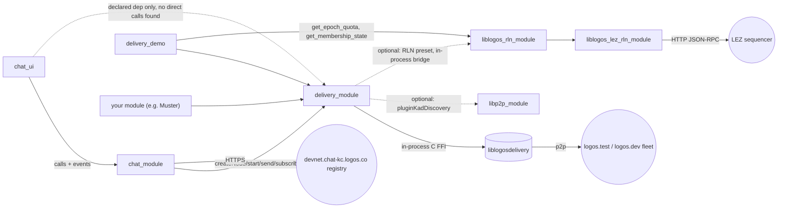

# Messaging stack

**Pinned at:** delivery_module 0.3.0 (`bec8594`), chat_module 0.3.0 (`5053dd5`), chat_ui 0.3.0
(`15c16ca`), delivery_demo 0.3.0 (`8625dba`), libp2p_module 1.1.0 (`49f7743`),
liblogos_rln_module 0.10.0 + liblogos_lez_rln_module 4.2.1 (logos-rln-modules `eb02da8`).

Scope: Logos Basecamp 0.3.1 (2026-10-01) default catalog `logos-co/logos-modules-release`. All
source facts below were read at the commits pinned in `data/catalog-pins.tsv`; links are
commit-pinned. "Unverified" = read in code/docs but not exercised at runtime.

## Summary

`delivery_module` is the transport everything else rides on: a C++ "universal" Logos module
wrapping `liblogosdelivery` (Nim, logos-delivery / Waku lineage) behind a C FFI. It runs **one
node per Logos Core instance**, shared by every module that depends on it; the first module to
call `createNode` picks the network for all of them. Apps publish raw bytes to a *content
topic* (`send`), subscribe to topics (`subscribe`), and receive everything through the
module-wide `messageReceived` event. `chat_module` (Rust, libchat) layers e2e-encrypted 1:1 and
group chat on top; `chat_ui` and `delivery_demo` are `ui_qml` front ends. `libp2p_module` is an
optional delivery dependency (plugin-hosted Kademlia discovery) and a standalone libp2p API.
The two RLN modules supply rate-limit proofs: the `logos.test` preset turns RLN **on** in
delivery 0.3.0, so a `logos.test` node needs both RLN modules installed and a funded, active
membership before `start` succeeds.

## Modules

| module | type / interface | role | depends on (metadata.json) | catalog version | pinned source |
|---|---|---|---|---|---|
| [`delivery_module`](../modules/delivery_module/README.md) | core / universal (C++ header codegen) | message transport node (relay/filter/lightpush/store, reliable channels) | none; **optional** `libp2p_module`, `liblogos_rln_module` | 0.3.0 | logos-delivery-module `bec8594` (tag v0.3.0) |
| [`chat_module`](../modules/chat_module/README.md) | core / cdylib (Rust, LIDL) | e2e chat (DirectV1, GroupV2) over delivery | `delivery_module >=0.3.0` | 0.3.0 | logos-chat-module `5053dd5` (v0.3.0) |
| [`chat_ui`](../modules/chat_ui/README.md) | ui_qml (C++ backend + QML, .rep) | Chat app UI | `chat_module >=0.3.0`, `delivery_module >=0.3.0` | 0.3.0 | logos-chat-ui `15c16ca` (v0.3.0) |
| [`delivery_demo`](../modules/delivery_demo/README.md) | ui_qml | educational playground for every delivery call | `delivery_module`, `liblogos_rln_module` | 0.3.0 | logos-delivery-demo `8625dbab` (v0.3.0) |
| [`libp2p_module`](../modules/libp2p_module/README.md) | core / universal | nim-libp2p node: peers, streams, gossipsub, kad DHT, service discovery | none | 1.1.0 | logos-libp2p-module `49f7743` (v1.1.0) |
| [`liblogos_rln_module`](../modules/liblogos_rln_module/README.md) | core / cdylib (Rust, zerokit) | RLN membership mgmt + proof gen/verify, encrypted keystore | `liblogos_lez_rln_module` | 0.10.0 | logos-rln-modules `eb02da8` (`logos-rln-module/`) |
| [`liblogos_lez_rln_module`](../modules/liblogos_lez_rln_module/README.md) | core / cdylib (Rust, LEZ wallet) | RLN registry provider: LEZ chain reads, Register tx, own wallet | none | 4.2.1 | logos-rln-modules `eb02da8` (`logos-lez-rln-module/`) |

Platforms (catalog `main`): `libp2p_module` and `liblogos_lez_rln_module` ship **no
windows-x86_64** build; the other five do. None of these is bundled in Basecamp 0.3.1; all
come from the catalog.

## Dependency / call direction



Events flow the other way: `delivery_module` events are broadcast to every subscriber in the
host, regardless of which module made the call.

## delivery_module

### Lifecycle (one node per host)

Contract: `createNode` exactly once per context, `start` before messaging, `stop` before
shutdown ([plugin.h L28-L48](https://github.com/logos-co/logos-delivery-module/blob/bec859430d963d5c0775af85456eff80d9d1c456/src/delivery_module_plugin.h#L28-L48)).

| call | returns | completion |
|---|---|---|
| `createNode(cfg: tstr) -> result` | sync; waits up to 30 s for the library callback | second call fails `"Context already initialized"` ([cpp L596-L603](https://github.com/logos-co/logos-delivery-module/blob/bec859430d963d5c0775af85456eff80d9d1c456/src/delivery_module_plugin.cpp#L596-L603)) |
| `start() -> result` | once dispatched | event `nodeStarted(success, message, ts)`; a failed start auto-stops the half-up node |
| `stop() -> result` | once dispatched | event `nodeStopped(success, message, ts)`; also stops the RLN backend |
| `getNodeInfo(id)` | sync | ids: `Version`, `Metrics`, `MyMultiaddresses`, `MyENR`, `MyPeerId`, `IsRunning` (`"true"`/`"false"`) — fails `"Context not initialized"` before any `createNode` |
| `getConnectionStatus()` | sync | `Disconnected` / `PartiallyConnected` / `Connected`; event only fires on transitions |

There is no destroy/re-create: switching network means unloading the module (process
restart). `delivery_demo` documents the shared-node model explicitly
([README L107-L111](https://github.com/logos-co/logos-delivery-demo/blob/8625dbabd322f4dcc23feaaeec5108ff276f18ea/README.md#L107-L111)):
the event log shows all modules' traffic, and `unsubscribe` / `channelClose` affect topics other
modules opened.

### Publish / subscribe / receive (Messaging API — the stable layer)

Signatures from the generated contract (`nix build github:logos-co/logos-delivery-module/bec859430d963d5c0775af85456eff80d9d1c456#lidl`):

```
method send(contentTopic: tstr, payload: bstr) -> result        ; value = requestId
method subscribe(contentTopic: tstr) -> result
method unsubscribe(contentTopic: tstr) -> result
event  messageReceived(messageHash: tstr, contentTopic: tstr, payload: bstr, source: tstr, timestamp: int)
event  messageQueued|messageSent|messagePropagated(requestId: tstr, messageHash: tstr, timestamp: int)
event  messageError(requestId: tstr, messageHash: tstr, error: tstr, timestamp: int)
```

- `send` base64-wraps the bytes into `{contentTopic, payload, ephemeral:false}` for
  `logosdelivery_ctx_send` ([cpp L884-L915](https://github.com/logos-co/logos-delivery-module/blob/bec859430d963d5c0775af85456eff80d9d1c456/src/delivery_module_plugin.cpp#L884-L915)).
  Outcome is async: `messageQueued` (RLN budget spent, still pending) → `messagePropagated` →
  `messageSent` (validated, terminal success) or `messageError`. Correlate by `requestId`.
- `subscribe` fails until the node is started (chat queues topics until then —
  [inbound.rs L151-L168](https://github.com/logos-co/logos-chat-module/blob/5053dd5062817f34a93055435781c1c448c7ce6c/rust-lib/src/inbound.rs#L151-L168)).
- `messageReceived.payload` is raw bytes; `source` is `"live"` or `"history"` (Store backfill at
  startup / after a gap, on by default). Upstream dedupe is in-memory for minutes only: **dedupe
  by `messageHash` yourself** ([plugin.h L441-L454](https://github.com/logos-co/logos-delivery-module/blob/bec859430d963d5c0775af85456eff80d9d1c456/src/delivery_module_plugin.h#L441-L454)).
- `messageReceived.timestamp` is the message's own timestamp; all other events carry local
  emission time; both int64 ns since epoch ([api_reference.rst L23-L29](https://github.com/logos-co/logos-delivery-module/blob/bec859430d963d5c0775af85456eff80d9d1c456/docs/pages/api_reference.rst#L23-L29)).
- A relay (`Core`) node sees the whole shard: chat observes `messageReceived` for topics it never
  subscribed to and filters by its topic prefix ([inbound.rs L99-L123](https://github.com/logos-co/logos-chat-module/blob/5053dd5062817f34a93055435781c1c448c7ce6c/rust-lib/src/inbound.rs#L99-L123)). **Always filter on `contentTopic`.**
- Content topic format: LIP-23 `/{app}/{version}/{name}/{encoding}`; chat uses
  `/logos-chat/1/<delivery_address>/proto` ([delivery.rs L13-L20](https://github.com/logos-co/logos-chat-module/blob/5053dd5062817f34a93055435781c1c448c7ce6c/rust-lib/src/delivery.rs#L13-L20)).
  Max message size on both fleets: 150 KiB.

### Reliable channels, Store, metrics, RLN surface

- `channelCreate(channelId, contentTopic, senderId)` / `channelExists(channelId)` (`"true"`/`"false"`)
  / `channelSend(channelId, payload: bstr)` → requestId / `channelClose(channelId)`. Events
  `channelMessageReceived(channelId, senderId, payload, ts)`, `channelMessageSent(channelId,
  requestId, ts)`, `channelMessageError(channelId, requestId, error, ts)`. SDS state persists;
  re-create with the same id restores it ([plugin.h L219-L269](https://github.com/logos-co/logos-delivery-module/blob/bec859430d963d5c0775af85456eff80d9d1c456/src/delivery_module_plugin.h#L219-L269)).
  Both peers must `channelCreate` the same `channelId`.
- `storeQuery(jsonQuery, peerAddr, timeoutMs)` — kernel API, explicitly unstable; query keys
  `requestId, includeData, paginationForward` (required) + `contentTopics, timeStart/End (ns),
  messageHashes, paginationCursor, paginationLimit` ([plugin.h L181-L217](https://github.com/logos-co/logos-delivery-module/blob/bec859430d963d5c0775af85456eff80d9d1c456/src/delivery_module_plugin.h#L181-L217)).
- `collectOpenMetricsText() -> tstr` (Prometheus text for the `openmetrics` module); `getAvailableConfigs()`.
- `rlnState()` → `{state: Disabled|Initializing|Ready|Failed, message, registryId?, rlnIdentifier?, epochSizeSec?}`;
  event `rlnStateChanged(state, message, ts)`. `rlnRespond(reqId, resultJson)`,
  `rlnBridgeEnable()` and the four `dispatchRln*RequestEvent`s are plumbing; the in-process
  bridge answers them on RLN presets ([plugin.h L335-L400](https://github.com/logos-co/logos-delivery-module/blob/bec859430d963d5c0775af85456eff80d9d1c456/src/delivery_module_plugin.h#L335-L400)).

### Configuration & presets

`createNode` JSON passes through verbatim to logos-delivery (`parseLogosDeliveryConf`).
App-developer shape ([plugin.h L64-L135](https://github.com/logos-co/logos-delivery-module/blob/bec859430d963d5c0775af85456eff80d9d1c456/src/delivery_module_plugin.h#L64-L135)):

```json
{ "mode": "Core", "preset": "logos.test",
  "messagingOverrides": { "logLevel": "INFO", "anonymityLevel": "None", "nat": "extip:1.2.3.4" } }
```

- Top level may only hold `entryLayer, mode, preset, kernelConf, messagingOverrides,
  channelsOverrides` (case-insensitive). **Any other top-level key flips to the legacy flat
  parser**, whose fixed port defaults collide between instances; the layered shape gets
  OS-assigned ports ([cpp L500-L513](https://github.com/logos-co/logos-delivery-module/blob/bec859430d963d5c0775af85456eff80d9d1c456/src/delivery_module_plugin.cpp#L500-L513)).
- `entryLayer`: `kernel` | `messaging` | `channels` (default). Kernel-only nodes reject
  `send`/`subscribe`/`channel*`.
- `mode`: `Core` (relay) | `Edge` (light node).
- `messagingOverrides` keys seen in sources: `logLevel`, `anonymityLevel` (`None` default |
  `Preferred` | `Required`; >None mounts mix; a mix node reports Disconnected until a mix exit
  is ready), `nat` (`any` default | `none` | `upnp` | `pmp` | `extip:<IP>`), `tcp-port`,
  `discv5-udp-port`, `quic-port`, `entry-node` (array of multiaddrs, for local peering),
  `cluster-id`, `backfillEnabled` (true), `backfillRequestTimeoutSeconds` (10),
  `pluginKadDiscovery`, `kad-bootstrap-node`, `localStoragePath`.

| preset | cluster | RLN | notes ([networks.md L26-L38](https://github.com/logos-co/logos-delivery-module/blob/bec859430d963d5c0775af85456eff80d9d1c456/docs/pages/networks.md#L26-L38)) |
|---|---|---|---|
| `logos.test` | 2 | **on**: registry `logos:testnet:841312e9…c893`, 600 s epochs, proofs attached, validation **off** | stable testnet fleet; default in chat |
| `logos.dev` | 3 | off | bleeding-edge fleet, may break |
| `twn`, `status.prod`, `""` | – | off | accepted preset names |

Both fleets: auto-sharding (8 shards), mix routing, discv5, Kademlia discovery on. RLN is not a
caller setting: it comes from the preset table in
[rln_presets.cpp L40-L62](https://github.com/logos-co/logos-delivery-module/blob/bec859430d963d5c0775af85456eff80d9d1c456/src/rln_presets.cpp#L40-L62);
override via `LOGOS_DELIVERY_RLN_PRESETS=<json file>` (exact preset spellings only, typos are
fatal). RLN identifier is application-wide `sha256("rln/logos-delivery/v0.0.1")` =
`5e269b6a…b977`. Bring-up: `createNode` installs the RLN plugin, then a background thread starts
`liblogos_rln_module` with `{"registries":[registryId],"epoch_size_sec":600}`; `start` then
passes only if the membership is `active`/`grace_period`
([rln.md L24-L79](https://github.com/logos-co/logos-delivery-module/blob/bec859430d963d5c0775af85456eff80d9d1c456/docs/pages/rln.md#L24-L79)).
Each send asks `get_epoch_quota` and is queued (`messageQueued`) while `remaining` is 0.
`pluginKadDiscovery: true` requires `libp2p_module` installed; only the first DHT bootstrap peer
is handed to libp2p; `LD_DISCO_TRACE=<file>` traces the plugin boundary
([architecture.md L52-L68](https://github.com/logos-co/logos-delivery-module/blob/bec859430d963d5c0775af85456eff80d9d1c456/docs/pages/architecture.md#L52-L68)).

### Persistence

Node state defaults to `<instance persistence path>/data` (injected as `localStoragePath` unless
the config names one) — [cpp L540-L594](https://github.com/logos-co/logos-delivery-module/blob/bec859430d963d5c0775af85456eff80d9d1c456/src/delivery_module_plugin.cpp#L540-L594).
Reliable-channel state persists there. Run multiple local instances with separate session dirs
(`--user-dir` for the standalone app, `--config-dir` for logoscore/logosctl).

## chat_module and chat_ui

Contract: [`rust-lib/chat_module.lidl`](https://github.com/logos-co/logos-chat-module/blob/5053dd5062817f34a93055435781c1c448c7ce6c/rust-lib/chat_module.lidl).

| flow | call(s) |
|---|---|
| init | `init(config: ChatConfig{ ?delivery_preset (default "logos.test"), ?log_level }) -> result`. Returns before the network is up; readiness = event `delivery_state_changed` reaching `"online"`. Subscribe to events **before** `init`. Re-`init` while initialised is a no-op; `shutdown()` first to reconfigure ([lidl L88-L124](https://github.com/logos-co/logos-chat-module/blob/5053dd5062817f34a93055435781c1c448c7ce6c/rust-lib/chat_module.lidl#L88-L124)) |
| identity | `get_address() -> tstr` (share out-of-band), `get/set_installation_name` |
| create conversation | `create_conversation(peer_address) -> result` (convo_id); `create_group_conversation(name, desc)`; `add_group_member(convo_id, peer_address)` (commit takes ~60 s+ on devnet) |
| send | `send_message(convo_id, content: tstr) -> result` — success = handed to delivery, not delivered |
| read | `list_conversations() -> [Conversation]`, `get_messages(convo_id) -> [Message]` (newest 500 reloaded), `list_group_members`, `status() -> Status` |
| local mgmt | `set_conversation_nickname`, `delete_conversation`, `get_log_path`, `health` |

Events ([lidl L199-L225](https://github.com/logos-co/logos-chat-module/blob/5053dd5062817f34a93055435781c1c448c7ce6c/rust-lib/chat_module.lidl#L199-L225)):
`message_received(convo_id, content, timestamp_ms, sender)`, `message_sent(convo_id, content,
timestamp_ms)`, `conversation_created(convo_id, is_outgoing, peer_label, kind, name, desc)`,
`conversation_updated(convo_id)`, `members_changed(convo_id)`, `conversation_deleted(convo_id)`,
`delivery_state_changed(delivery_state: initialising|online|error|stopped, detail, delivery_adopted)`.

How chat drives delivery ([actions.rs L222-L315](https://github.com/logos-co/logos-chat-module/blob/5053dd5062817f34a93055435781c1c448c7ce6c/rust-lib/src/actions.rs#L222-L315)):
`createNode({"mode":"Core","preset":<p>,"messagingOverrides":{"logLevel":"ERROR"}})`; if refused,
probe `getNodeInfo("Version")` — an answer means another module owns the node, so it **adopts**
it (`delivery_adopted=true`, keeps that node's preset) — then `start()`. It marks itself
`online` when `start()` is accepted (not on `nodeStarted`) and maps later
`connectionStateChanged` (`Connected|PartiallyConnected` → online, else error). It never stops
the node. It subscribes `messageReceived` + `connectionStateChanged` before starting
([actions.rs L163-L179](https://github.com/logos-co/logos-chat-module/blob/5053dd5062817f34a93055435781c1c448c7ce6c/rust-lib/src/actions.rs#L163-L179)).

Persistence/identity: `chat.db` (SQLCipher, WAL) in the instance persistence path, keyed from the
path itself — obfuscated, not protected ([persistence.rs L1-L21](https://github.com/logos-co/logos-chat-module/blob/5053dd5062817f34a93055435781c1c448c7ce6c/rust-lib/src/persistence.rs#L1-L21)).
libchat identity/MLS state is **in-memory only** (`LIBCHAT_PERSISTENCE_ENABLED = false`,
[module.rs L40-L49](https://github.com/logos-co/logos-chat-module/blob/5053dd5062817f34a93055435781c1c448c7ce6c/rust-lib/src/module.rs#L40-L49)):
every `init` is a new account/address; old conversations reload `history_only`. Accounts and key
packages go to a hardcoded HTTPS registry `https://devnet.chat-kc.logos.co`
([actions.rs L24-L29](https://github.com/logos-co/logos-chat-module/blob/5053dd5062817f34a93055435781c1c448c7ce6c/rust-lib/src/actions.rs#L24-L29)).
`init` fails if the host assigned no persistence path.

`chat_ui` calls only `chat_module` (init with preset `logos.test`, [ChatBackend.cpp L178-L220](https://github.com/logos-co/logos-chat-ui/blob/15c16ca4ad48efe63993daa0765cac8ca9f7c36d/src/ChatBackend.cpp#L178-L220));
its `delivery_module` dependency appears to exist only so the host installs/loads it.

## delivery_demo

Reference C++ consumer; read it before writing a delivery client. `initLogos` builds
`LogosModules(api)`, wires events, then *reads* node state (node may already exist)
([plugin.cpp L23-L44](https://github.com/logos-co/logos-delivery-demo/blob/8625dbabd322f4dcc23feaaeec5108ff276f18ea/src/delivery_demo_plugin.cpp#L23-L44));
event handlers + queued hops ([L46-L171](https://github.com/logos-co/logos-delivery-demo/blob/8625dbabd322f4dcc23feaaeec5108ff276f18ea/src/delivery_demo_plugin.cpp#L46-L171));
`createNode`+`start` ([L313-L378](https://github.com/logos-co/logos-delivery-demo/blob/8625dbabd322f4dcc23feaaeec5108ff276f18ea/src/delivery_demo_plugin.cpp#L313-L378));
`send` with raw `QByteArray` ([L462-L475](https://github.com/logos-co/logos-delivery-demo/blob/8625dbabd322f4dcc23feaaeec5108ff276f18ea/src/delivery_demo_plugin.cpp#L462-L475)).
It also polls `liblogos_rln_module.get_epoch_quota` (2 s) and `get_membership_state` (10 s)
using the scope read back from `delivery_module.rlnState()`. Its README still documents a
`configureRln` method and "pinned to v0.2.0" — stale; the code and flake target v0.3.0, where
RLN comes from the preset.

## libp2p_module

Standalone nim-libp2p node, one per host, created with defaults at load. Config via env
`LIBP2P_MODULE_CONFIG` (inline JSON or path) or `createNode(configJson)` before `start`; schema
in [metadata.json L18-L58](https://github.com/logos-co/logos-libp2p-module/blob/49f77430fbe6cc8dbb8eee2361670d7396565e5b/metadata.json#L18-L58)
(`addrs`, `bootstrapNodes`, `transport` tcp|quic, `privKey`, `mountGossipsub`, `mountKad`,
`mountServiceDiscovery`, NAT/relay flags, gossipsub queue/size limits). API groups
([plugin.h L177-L251](https://github.com/logos-co/logos-libp2p-module/blob/49f77430fbe6cc8dbb8eee2361670d7396565e5b/src/plugin.h#L177-L251)):
peers (`connectPeer`, `connectedPeers`, `pingPeer`), streams, a JSON custom-protocol bridge
(`mountProtocol`, `protocolRequest{peerId,proto,requestB64,…}` → `{responseB64}`,
`protocolAcceptStream` polling — [README L142-L177](https://github.com/logos-co/logos-libp2p-module/blob/49f77430fbe6cc8dbb8eee2361670d7396565e5b/README.md#L142-L177)),
gossipsub (`gossipsubPublish(topic, data)`, `gossipsubSubscribe`, `gossipsubNextMessage(topic,
timeoutMs)` polling), kad DHT, service discovery (`disco*`), peerstore. Push events
`gossipsubMessage {topic,data}` and `protocolStream {streamId,proto,peerId}` are emitted but
**not declared in the LIDL**, so typed clients get no `on_*` accessor (use generic `on(name)`).
`delivery_module` with `pluginKadDiscovery` configures and shares this same node.

## RLN modules (liblogos_rln_module + liblogos_lez_rln_module)

`liblogos_rln_module` contract ([lidl](https://github.com/logos-co/logos-rln-modules/blob/eb02da8f0cbbfc892365f32a713087f7cdb9aaa0/logos-rln-module/rust-lib/liblogos_rln_module.lidl)):
every call is scoped by `(registry_id CAIP-10, rln_identifier_hex)`. Two reply dialects: `result`
methods (`start`, `stop`, `generate_proof`, `validate_proof`, `get_epoch_quota`,
`get_registry_parameters`) vs `tstr` JSON methods with in-band `{"error":{class,kind,message}}`;
switch on `class` ∈ `not_ready|transient|budget_exhausted|permanent`
([lidl L14-L34](https://github.com/logos-co/logos-rln-modules/blob/eb02da8f0cbbfc892365f32a713087f7cdb9aaa0/logos-rln-module/rust-lib/liblogos_rln_module.lidl#L14-L34)).
Key methods: `start(config_json{epoch_size_sec REQUIRED, max_epoch_gap?, registries?})`,
`register_membership(registry_id, rln_identifier_hex, options_json)`, `get_membership_state`,
`get_epoch_quota(…, timestamp) → {epoch_index, rate_limit, remaining}`, `generate_proof`,
`validate_proof`; event `membership_state_changed(registry_id, rln_identifier, membership_hash,
state, previous)`. Since 0.10.0 `start()` auto-provisions a **registry-wide** membership once the
lez module's own wallet payer is funded ([ensure.rs L1-L28](https://github.com/logos-co/logos-rln-modules/blob/eb02da8f0cbbfc892365f32a713087f7cdb9aaa0/logos-rln-module/rust-lib/src/ensure.rs#L1-L28)).
Keystore lives in the instance persistence path (`rln_sealed.json`, `rln_allocations.json`,
`rln_cache.json`), auto-unlocked via `rln_autounlock.secret` by default
(`LOGOS_RLN_DISABLE_AUTO_UNLOCK=1` opts out); one process per keystore; never copy it
([README L130-L160](https://github.com/logos-co/logos-rln-modules/blob/eb02da8f0cbbfc892365f32a713087f7cdb9aaa0/logos-rln-module/README.md#L130-L160)).
`liblogos_lez_rln_module`: `wallet_status() → {payer, ready, state, network}` (fund that `payer`),
`use_network(reference)`, `get_native_balance`, `register_member`, registry reads; built-in
network `testnet` = sequencer `http://209.38.241.182:3240/`
([networks.json L20-L32](https://github.com/logos-co/logos-rln-modules/blob/eb02da8f0cbbfc892365f32a713087f7cdb9aaa0/logos-lez-rln-module/rust-lib/networks.json#L20-L32)).
Funding for `logos.test`: ≥ 200 000 000 native LEZ testnet to the payer; membership active ~1–3
min later; rate limit 100 per 600 s epoch ([run-node.md L121-L150](https://github.com/logos-co/logos-delivery-module/blob/bec859430d963d5c0775af85456eff80d9d1c456/docs/pages/run-node.md#L121-L155)).

## Using delivery_module from another module

1. **Declare the dependency.** `metadata.json`: `"dependencies": ["delivery_module"]` (or
   `[{ "name": "delivery_module", "version": ">=0.3.0" }]` as chat does). On a `logos.test`
   deployment also list (or ensure install of) `liblogos_rln_module`; delivery only lists it as
   optional. If you read RLN state yourself, depend on it directly (delivery_demo does).
2. **Get the contract.** The builder resolves a declared dependency's contract only from a flake
   input with the **same name** (`delivery_module = { url = "github:logos-co/logos-delivery-module/v0.3.0"; inputs.logos-module-builder.follows = …; }`,
   [demo flake L13-L28](https://github.com/logos-co/logos-delivery-demo/blob/8625dbabd322f4dcc23feaaeec5108ff276f18ea/flake.nix#L13-L28)),
   or map it via `flakeInputs = { delivery_module = <input>; }` (chat). Keep emitter and consumer
   on the same `logos-module-builder` (binary event payload wire form). A cdylib module can
   instead pin a contract file with `"dependency_overrides": { "<dep>": { "file": "…lidl" } }`
   (pattern used by `liblogos_rln_module`). Exact contract: `nix build github:logos-co/logos-delivery-module/<commit>#lidl`.
3. **Subscribe first.** Register `messageReceived`, `connectionStateChanged`, `nodeStarted`
   (and `messageSent`/`messageError` if you track sends) before calling `createNode`/`start`;
   transition events are not replayed.
   - C++: `LogosModules m(api); m.delivery_module.on("messageReceived", [](const QVariantList& d){ /* d[0]=hash d[1]=topic d[2]=QByteArray payload d[3]=source d[4]=ts */ });`
   - Rust (generated client): `modules().delivery_module.on_message_received()` → `EventSubscription`;
     decode with `DeliveryModuleClient::decode_message_received(&evt)` (`message_hash`,
     `content_topic`, `payload`, `source`). Calls: `create_node_async`, `start_async`,
     `subscribe_async`, `send_async(&topic, &bytes, cb)`, `get_node_info_async`. The client's
     `Ok` only means the call arrived — unwrap the `{success,value,error}` envelope yourself
     ([delivery.rs L22-L45](https://github.com/logos-co/logos-chat-module/blob/5053dd5062817f34a93055435781c1c448c7ce6c/rust-lib/src/delivery.rs#L22-L45)).
   - Nim (`logos-nim-sdk`): not covered by any source read here — unverified; generate from the same LIDL.
4. **Adopt-or-create the node.** `createNode(layered cfg)`; on failure probe
   `getNodeInfo("Version")` (or `"IsRunning"`) — success means the node exists (someone else's
   preset wins); then `start()` and wait for `nodeStarted(success=true)` or read
   `getNodeInfo("IsRunning")`/`getConnectionStatus()`. Do not call `stop()` on a node you share.
5. **Subscribe your topics after start**, publish with `send(topic, bytes)`, keep a map
   `requestId → your message` for `messageSent`/`messageError`/`messageQueued`.
6. **Receive defensively:** filter `contentTopic` by your prefix, dedupe on `messageHash` (bounded
   LRU like chat's 10 000), expect `source:"history"` replays after restarts.
7. **Threading:** events arrive on the SDK dispatch thread and calls are `DirectConnection`;
   never make a synchronous delivery call from inside an event handler — hop to your own thread
   (`QMetaObject::invokeMethod(…, Qt::QueuedConnection)` in C++, a channel/worker in Rust), and
   prefer async calls for `send` (chat: sync `send` blocks the dispatch thread).
8. **Budget:** on `logos.test` every module on the node shares one RLN membership — default 100
   messages per 600 s epoch — so a chatty module starves chat and vice versa.

## Gotchas & open questions

- `createNode` is first-caller-wins for the whole host; `chat_module` defaults to `logos.test`,
  so whatever loads first decides the network for Muster too. `Status.delivery_adopted` /
  `delivery_adopted` events tell you chat joined someone else's node.
- **RLN on `logos.test` changed at v0.3.0 final** (`e8f48b7`, PR #149). `chat_module` 0.3.0 is
  built against `v0.3.0-rc.3` ([flake L16](https://github.com/logos-co/logos-chat-module/blob/5053dd5062817f34a93055435781c1c448c7ce6c/flake.nix#L16)),
  where `logos.test` had RLN off, and its doctests install only delivery+chat. With catalog
  delivery 0.3.0, a `logos.test` node without RLN modules + funded membership should fail at
  `start` per rln.md — runtime behaviour in Basecamp unverified. Basecamp now offers optional
  packages during install (basecamp #452).
- `chat_module` reports `online` on `start()` acceptance, not on `nodeStarted`, and has no RLN
  handling — a failed RLN-gated start surfaces only via connection status (unverified).
- Config keys at top level silently switch to the flat parser (port collisions between
  instances).
- `liblogos_lez_rln_module` and `libp2p_module` have no Windows build; `pluginKadDiscovery` and
  `logos.test` RLN therefore cannot work on Windows.
- `run-node.md` still says the RLN modules live in a separate catalog
  (`logos-rln-modules` index); both are in the Basecamp 0.3.1 default catalog snapshot.
- `chat_module` identity is ephemeral per `init`; persisted history is read-only (`history_only`).
- `libp2p_module` gossipsub events serialise payload as a JSON string; non-UTF-8 payloads appear
  to throw in `dump()` and be dropped before queueing ([callbacks.cpp L174-L196](https://github.com/logos-co/logos-libp2p-module/blob/49f77430fbe6cc8dbb8eee2361670d7396565e5b/src/callbacks.cpp#L174-L196)) — unverified; base64 your data.
- Open: no host-owned delivery lifecycle yet (chat TODO in actions.rs); whether `start()` on an
  already-started node is harmless is unverified (chat calls it when adopting).
