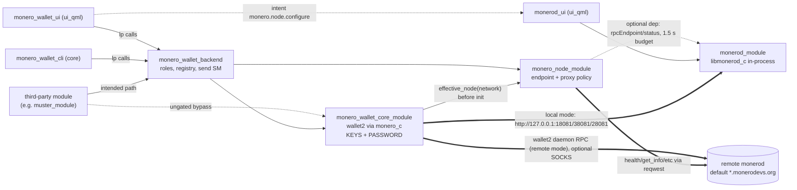

# Monero wallet stack

**Pinned at:** Basecamp 0.3.1 (`aeb8192`); monero_node_module 0.1.0 (`ddaec93`), monero_wallet_backend 0.1.0 (`7690984`), monero_wallet_cli 0.1.0 (`9f5958f`), monero_wallet_core_module 0.1.0 (`7fc923d`), monero_wallet_ui 0.1.0 (`345fc5d`), monerod_module 0.1.0 (`9ed580d`), monerod_ui 0.1.0 (`10aaf70`).

Seven catalog packages (none bundled in Basecamp 0.3.1), all `0.1.0`, all published 2026-09-28..30.
Source read at the commits pinned in `data/catalog-pins.tsv`:

| catalog name | repo @ pinned commit |
|---|---|
| `monero_wallet_core_module` | [logos-monero-wallet-core-module@7fc923d](https://github.com/logos-co/logos-monero-wallet-core-module/tree/7fc923dcce9ac5d40db8dd30f658eb63849e7212) |
| `monero_wallet_backend` | [logos-monero-wallet-backend@7690984](https://github.com/logos-co/logos-monero-wallet-backend/tree/769098441db339f7541ba8804722ae3f20614309) |
| `monero_node_module` | [logos-monero-node-module@ddaec93](https://github.com/logos-co/logos-monero-node-module/tree/ddaec9337b4d1c4d1ccc4cea6fdd4163b2dd6e0f) |
| `monerod_module` | [logos-monerod-module@9ed580d](https://github.com/logos-co/logos-monerod-module/tree/9ed580d1423f3415f5934a18faddf022b616cb86) |
| `monerod_ui` | [logos-monerod-ui@10aaf70](https://github.com/logos-co/logos-monerod-ui/tree/10aaf706751d4133bebe7fae42db21611f0704d9) |
| `monero_wallet_ui` | [logos-monero-wallet-ui@345fc5d](https://github.com/logos-co/logos-monero-wallet-ui/tree/345fc5deb3ac61844dc27bb396bd77087e89c05c) |
| `monero_wallet_cli` | [logos-monero-wallet-cli@9f5958f](https://github.com/logos-co/logos-monero-wallet-cli/tree/9f5958f7172a2f12c7fa16996da1ea3fdf1a7905) |
| (build input) | [logos-monero-nix@e2f5703](https://github.com/logos-co/logos-monero-nix/tree/e2f570312db09c46ffe13f12050e98a26b945e8c) (monerod_module's pin; wallet core pins `f981568`) |

## 1. Design in one paragraph

`monero_wallet_core_module` (C++) wraps monero_c, the C ABI of Monero's own `wallet2_api.h`
(monero_c `v0.18.4.6-RC2`, built from source by logos-monero-nix, LGPL-3.0, dynamically linked),
and is the only process that holds a wallet password, seed or key. It holds **exactly one open
wallet per instance**; every long wallet2 call (open/create/restore/close/rescan/build/commit/
change password) is a **ticket** (`startJob` → `jobStatus` → `jobResult` → `ackJob`) served by
one worker thread, while reads answer directly
([README L8-19](https://github.com/logos-co/logos-monero-wallet-core-module/blob/7fc923dcce9ac5d40db8dd30f658eb63849e7212/README.md#L8-L19)).
`monero_wallet_backend` (Rust) is the coordinator every surface is meant to use: wallet registry,
sync/balance poller turned into events, history normalisation, and a **build → review →
broadcast** send state machine, behind a role gate (custodian / approver)
([README](https://github.com/logos-co/logos-monero-wallet-backend/blob/769098441db339f7541ba8804722ae3f20614309/README.md#L3-L19)).
`monero_node_module` (Rust) owns per-network daemon endpoint + proxy policy (fail-closed when a
proxy is required) and never runs a node; `monerod_module` runs monerod in-process via
`libmonerod_c`. Two surfaces sit on the backend: `monero_wallet_ui` (GUI, holds both roles by
default) and `monero_wallet_cli` (headless relay for `logosctl`). The review step governs
**broadcast, not signing** — the engine signs when it builds the preview.

## 2. Modules

| module | type / interface | role | holds key material? | depends on (metadata.json) |
|---|---|---|---|---|
| `monero_wallet_core_module` | core / universal (C++) | wallet2 engine, tickets, reads, seed/view-key reveal | **Yes** — password (transiently), keys in wallet2, wallet files | `monero_node_module` |
| `monero_wallet_backend` | core / cdylib (Rust) | registry, roles gate, poller → events, send state machine | No (passwords pass through as call args, not stored) | `monero_wallet_core_module`, `monero_node_module` |
| `monero_node_module` | core / cdylib (Rust) | per-network endpoint/proxy config, monerod JSON-RPC client | No (but stores daemon RPC username/password in plaintext) | none; optional `monerod_module` |
| `monerod_module` | core / universal (C++) | in-process monerod, per-network config, start/stop/status/log | No | none |
| `monero_wallet_ui` | ui_qml | the wallet GUI; default custodian + approver; provides `monero.wallet.unlock`, `monero.accounts.manage` | No (password is a SLOT arg; seed a SLOT return) | backend, core, node (calls only the backend) |
| `monerod_ui` | ui_qml | local node manager; provides `monero.node.configure` (handoff) | No | `monerod_module` |
| `monero_wallet_cli` | core / cdylib (Rust) | headless relay of backend methods for `logosctl`; needs both roles enrolled | No (passwords via `@file`, scrubbed after use) | `monero_wallet_backend` |

Canonical contracts: `modules/<name>/<name>.lidl`. Note the derived `.lidl` of the three Rust
modules prints `depends []` even though `metadata.json` declares dependencies.

## 3. Dependencies and call direction

The wallet's own chain traffic is wallet2 → daemon directly; the node module only supplies the
endpoint (and does its own health/RPC calls). Local vs remote is the node config's `mode`.

## 4. Trust boundaries

**Who holds secrets.** Password: typed into `monero_wallet_ui` (or a CLI `@file`), passed as a
string argument UI → backend → core, used by wallet2, never stored or cached
([core impl.h L20-22](https://github.com/logos-co/logos-monero-wallet-core-module/blob/7fc923dcce9ac5d40db8dd30f658eb63849e7212/src/monero_wallet_core_impl.h#L20-L22)).
Seed/view key leave only via `revealSeed(password)` / `revealViewKey(password)`, which re-verify
the password against the `.keys` file
([wallet_runtime.cpp L652-667](https://github.com/logos-co/logos-monero-wallet-core-module/blob/7fc923dcce9ac5d40db8dd30f658eb63849e7212/src/wallet_runtime.cpp#L652-L667)).
No method returns the spend key. Wallet files are chmod 0600 in a 0700 dir
([L397-400](https://github.com/logos-co/logos-monero-wallet-core-module/blob/7fc923dcce9ac5d40db8dd30f658eb63849e7212/src/wallet_runtime.cpp#L397-L400)).
The daemon RPC password lives in plaintext in the node module's `monero_nodes.json`;
`monero_node_module.get_node_config` returns it unredacted to any caller — only the backend's
`node_config` redacts it to `hasPassword`
([backend glue.rs L702-722](https://github.com/logos-co/logos-monero-wallet-backend/blob/769098441db339f7541ba8804722ae3f20614309/rust-lib/src/glue.rs#L702-L722)).

**Caller identity.** The backend reads the host-pushed caller (`logos_rust_sdk::current_caller()`:
`Unknown | HostAnchor | Module{name} | Derived{parent,leaf} | Operator{name}`) and only a plain
`Module(name)` can hold a role or request a send; the host anchor (shell, `logoscore`/`logosctl`
CLI tokens) is always refused
([glue.rs L168-179](https://github.com/logos-co/logos-monero-wallet-backend/blob/769098441db339f7541ba8804722ae3f20614309/rust-lib/src/glue.rs#L168-L179),
[gate.rs L99-132](https://github.com/logos-co/logos-monero-wallet-backend/blob/769098441db339f7541ba8804722ae3f20614309/rust-lib/src/gate.rs#L99-L132)).
`caller_identity()` reports what you authenticated as. Neither the core, node, monerod nor CLI
module checks its caller at all.

**Backend role gate** ([gate.rs L8-17, L99-132](https://github.com/logos-co/logos-monero-wallet-backend/blob/769098441db339f7541ba8804722ae3f20614309/rust-lib/src/gate.rs#L8-L132)):

| gate | methods | default holders |
|---|---|---|
| custodian | `open_wallet`, `create_wallet`, `restore_from_seed`, `restore_from_keys`, `change_password`, `reveal_seed`, `reveal_view_key`, `set_active_network`, `set_node_config` | `["monero_wallet_ui"]` |
| approver | `confirm_send` | `["monero_wallet_ui"]` |
| either role | `close_wallet` | — |
| any named module | `prepare_send`, `cancel_send` (for **any** request id, not just your own) | — |
| ungated | `configure`, `caller_identity`, `list_networks`, `list_wallets`, `job_status`, `wallet_status`, `balances`, `receive_info`, `create_subaddress`, `set_subaddress_label`, `history`, `address_valid`, `node_health`, `node_config`, `local_node`, `send_status`, `list_sends`, `format_xmr`, `parse_xmr` | — |

Refusals are the opaque `{"ok":false,"error":"not authorized"}`.

**`configure` is ungated** — "any caller can name itself custodian. Protecting it is deferred,
not refuted" ([glue.rs L22-30](https://github.com/logos-co/logos-monero-wallet-backend/blob/769098441db339f7541ba8804722ae3f20614309/rust-lib/src/glue.rs#L22-L30)).
It is TOTAL (a role not named is held by nobody) and in-memory only; persistent roles come from
`roles.json` in the backend's instance dir, read once at load (absent → defaults; unreadable →
both roles empty) ([L467-477](https://github.com/logos-co/logos-monero-wallet-backend/blob/769098441db339f7541ba8804722ae3f20614309/rust-lib/src/glue.rs#L467-L477)).

**Receipts.** Core tickets return `{jobId:"jN", receipt:<32 hex>}`; the receipt gates only
`jobStatus/jobResult/ackJob/cancelJob` of that ticket, so a job id seen on the event plane is
useless alone ([wallet_runtime.cpp L153-214](https://github.com/logos-co/logos-monero-wallet-core-module/blob/7fc923dcce9ac5d40db8dd30f658eb63849e7212/src/wallet_runtime.cpp#L153-L214)).
It does **not** gate wallet operations: `commit_transaction` takes only `txHandle`, which is
sequential (`tx1`, `tx2`, …) and not bound to the creating ticket
([L469, L481-499](https://github.com/logos-co/logos-monero-wallet-core-module/blob/7fc923dcce9ac5d40db8dd30f658eb63849e7212/src/wallet_runtime.cpp#L469-L499)).
The backend hides core receipts and exposes its own `bN` job ids and `sN` send ids, both readable
by anyone.

**Inter-module access.** Basecamp's `--access-policy` is **off by default**: any loaded module may
call any other. With `enforce`, a module may call only what its `metadata.json` declares
([Basecamp README L212-258](https://github.com/logos-co/logos-basecamp/blob/a4b952280b8fb3f256f4b1f9174dda19a2cad5d9/README.md#L212-L258)).

**What a malicious (or buggy) loaded module can do today** (default policy, or enforce + it
declares the module it calls):
- Via the **core directly**, while any wallet is open: `startJob("create_transaction", …)` then
  `startJob("commit_transaction", {txHandle})` — spend with no password and no approver; or commit
  the `txHandle` of a preview the user is still reviewing; `close_wallet`; `rescan`.
- Via the backend: `configure` itself into approver/custodian (and evict the GUI); cancel anyone's
  send; occupy the single send slot; read full history, balances, all subaddresses (a privacy
  leak for a privacy coin); mint subaddresses / relabel them.
- Via the node module: `set_node_config` (bypasses the backend's custodian gate) to point the next
  wallet open at an attacker's daemon or drop `proxyRequired`; read the stored RPC password.
- Via `monero_wallet_cli` once enrolled: it is a confused deputy — it relays custodian/approver
  calls for **whoever calls it** (no caller check; [glue.rs L182-280](https://github.com/logos-co/logos-monero-wallet-cli/blob/9f5958f7172a2f12c7fa16996da1ea3fdf1a7905/rust-lib/src/glue.rs#L182-L280)).
- Guess the wallet password through `revealSeed`; no attempt limit was found (unverified beyond
  reading `verifyPassword`).

So the role gate separates the honest surfaces; it is not a boundary against co-loaded code.

## 5. Flows (backend API unless noted)

All backend methods return a **JSON string** `{ "ok": true, … }` / `{ "ok": false, "error" }`
(`address_valid` returns a bool). Amounts are **decimal strings of atomic units** (1 XMR = 1e12);
`format_xmr` / `parse_xmr` are exact and `parse_xmr` refuses >12 decimals
([model.rs L33-59](https://github.com/logos-co/logos-monero-wallet-backend/blob/769098441db339f7541ba8804722ae3f20614309/rust-lib/src/model.rs#L33-L59)).
Full signatures: [glue.rs trait L21-116](https://github.com/logos-co/logos-monero-wallet-backend/blob/769098441db339f7541ba8804722ae3f20614309/rust-lib/src/glue.rs#L21-L116).

**Networks.** `list_networks()` → `{networks:["mainnet","stagenet","testnet","regtest"], active}`.
The backend's active network **defaults to `stagenet`**
([L156](https://github.com/logos-co/logos-monero-wallet-backend/blob/769098441db339f7541ba8804722ae3f20614309/rust-lib/src/glue.rs#L156));
`set_active_network(n)` is custodian-only and refused while a wallet is open or a send is in flight.

**Create / restore** (custodian; all start a job and return `{ok, jobId:"bN"}`):
- `create_wallet(name, password, label)` — on the active network; language fixed to English.
- `restore_from_seed('{"name","password","seed":"<25 words>","restoreHeight":<number>,"seedOffset"?,"label"?}')`
- `restore_from_keys('{"name","password","address","viewKey","spendKey"?,"restoreHeight":<number>,"label"?}')` — omit/empty `spendKey` ⇒ view-only.
- `restoreHeight` must be a JSON **number** (`as_u64`; anything else becomes 0 = scan from genesis,
  hours) ([L567-594](https://github.com/logos-co/logos-monero-wallet-backend/blob/769098441db339f7541ba8804722ae3f20614309/rust-lib/src/glue.rs#L567-L594)).
- Names may not contain `/` or `..`; create/restore fail if the name exists. A created/restored
  wallet is left **open**.

**Open / close.** `open_wallet(name, password)` (custodian) → job. The registry refuses a wallet
known to belong to another network; the core then checks wallet2's nettype after decrypting
([wallet_runtime.cpp L347-354](https://github.com/logos-co/logos-monero-wallet-core-module/blob/7fc923dcce9ac5d40db8dd30f658eb63849e7212/src/wallet_runtime.cpp#L347-L354)).
Refused with "a wallet is already open; close it first" if any wallet is open.
`close_wallet()` (either role) → job; stores, closes, drops pending transactions.
`job_status("bN")` → `{ok, jobId, kind, state: queued|running|done|failed, result?, error?}`;
open-like results are `{name, network, address, watchOnly}`.
`list_wallets()` → `{wallets:[{name, network, label, viewOnly, restoreHeight, address}]}` (files
never opened show `network:""`).

**Sync & status.** wallet2 auto-refreshes every 2 s after open. `wallet_status()` → core status
`{state: no_wallet|opening|syncing|ready|closing|failed, wallet, network, address, connected,
synchronized, walletHeight, daemonHeight, watchOnly, lastError, libraryVersion}` + `syncPercent`,
`activeNetwork`, `meta`. While a build holds the wallet (~15 s) it answers `busy:true` with **no**
chain fields ([wallet_runtime.cpp L535-552](https://github.com/logos-co/logos-monero-wallet-core-module/blob/7fc923dcce9ac5d40db8dd30f658eb63849e7212/src/wallet_runtime.cpp#L535-L552)).
Rescan exists only as the core ticket `rescan`; the backend does not expose it.

**Balances.** `balances(account_index)` → `{ok, balance, unlocked, balanceXmr, unlockedXmr}`, or
`{ok:false, busy:true}` during a build. With **no wallet open it answers `"0"`**, so gate on
`wallet_status().state` first ([L646-660](https://github.com/logos-co/logos-monero-wallet-backend/blob/769098441db339f7541ba8804722ae3f20614309/rust-lib/src/glue.rs#L646-L660)).

**Subaddresses.** `receive_info(account)` → `{ok, address, subaddresses:[{index, address, label}]}`;
`create_subaddress(account, label)` → `{ok, index, address}` (stored immediately);
`set_subaddress_label(account, index, label)` → `{ok, index, label}`. No method creates a new
*account*; the GUI only ever uses account 0.

**Send** ([prepare/confirm/cancel L762-837](https://github.com/logos-co/logos-monero-wallet-backend/blob/769098441db339f7541ba8804722ae3f20614309/rust-lib/src/glue.rs#L762-L837),
[state machine model.rs L178-283](https://github.com/logos-co/logos-monero-wallet-backend/blob/769098441db339f7541ba8804722ae3f20614309/rust-lib/src/model.rs#L178-L283)):
1. `prepare_send('{"address":"…","amountXmr":"0.5"}')` or `"amount":"500000000000"` (strings;
   `amountXmr` wins), optional `"priority"` (number 0-3) and `"accountIndex"` (number) →
   `{ok, requestId:"sN"}`. Address validated against the current network. **One non-terminal send
   at a time, globally** ("a send is already in flight (sN: state)").
2. Core builds (`create_transaction` → `MONERO_Wallet_createTransaction`, refresh paused, ~15 s) and
   **signs**. `send_status(sN)` → `{ok, requestId, state, preview?, txids?, error?}` where
   `preview = {destination, amount, amountXmr, fee, feeXmr, total, totalXmr, txCount, txids}`
   (txids are known before broadcast).
3. `confirm_send(sN)` (approver, state must be `previewed`) → `committing` → `sent` (`txids`) |
   `failed` | `unknown` ("may or may not have reached the network — check Activity").
4. `cancel_send(sN)` while `preparing`/`previewed`; a `previewed` send older than **120 s** becomes
   `failed: "preview expired"`. Records are never pruned (`list_sends` grows).
States: `preparing | previewed | committing | sent | failed | cancelled | unknown`.

**History.** `history()` → `{ok, rows:[…]}` newest first (pending/height-0 on top). Row:
`txid, direction ("in"|"out"), amount, amountXmr, fee, feeXmr, height, confirmations, timestamp,
pending, failed, unlockTime, account, paymentId, description, subaddrIndex, coinbase, destinations`.
`subaddrIndex` is a **comma-joined string** (e.g. `"3"` or `"1,4"`); `destinations` is filled only
for outgoing transfers ([model.rs L142-176](https://github.com/logos-co/logos-monero-wallet-backend/blob/769098441db339f7541ba8804722ae3f20614309/rust-lib/src/model.rs#L142-L176),
[core L608-646](https://github.com/logos-co/logos-monero-wallet-core-module/blob/7fc923dcce9ac5d40db8dd30f658eb63849e7212/src/wallet_runtime.cpp#L608-L646)).

**Secrets.** `reveal_seed(password)` → `{ok, seed}` (fails "this wallet has no seed" for key
restores); `reveal_view_key(password)` → `{ok, viewKey, address}`; `change_password(old, new)` → job.
All custodian.

**View-only wallets.** `restore_from_keys` without `spendKey`. `create_transaction` refuses "view-only
wallet cannot spend". There is no export-outputs / import-key-images / unsigned-tx API, so no
cold-signing workflow.

**Local vs remote node.** Node config per network (`monero_node_module.set_node_config(network,
json)`, or backend `set_node_config(json)` for the active network, custodian, refused while a
wallet is open): `{url, username?, password?, proxy?, proxyRequired?, timeoutSecs?(8), trusted?,
mode?: "remote"|"local"}`; a full replace, so omit `mode` ⇒ remote
([node.rs L44-68](https://github.com/logos-co/logos-monero-node-module/blob/ddaec9337b4d1c4d1ccc4cea6fdd4163b2dd6e0f/rust-lib/src/node.rs#L44-L68)).
In local mode `effective_node` returns monerod_module's `http://127.0.0.1:<rpcBindPort>`, trusted,
unproxied, and **never falls back to remote**; absent monerod_module fails within 1.5 s; refused on
regtest ([node.rs L220-238](https://github.com/logos-co/logos-monero-node-module/blob/ddaec9337b4d1c4d1ccc4cea6fdd4163b2dd6e0f/rust-lib/src/node.rs#L220-L238)).
The node must be **started before** the wallet opens (`monerod_ui`, or
`monerod_module.start(network)`); wallet2 binds its daemon at init. `local_node()` says whether
local mode can be offered; `node_health()` → `{reachable, height, targetHeight, synced,
restricted, rttMs, mode, route, local?}`.

## 6. Using this stack from a third-party module

Assumes a core module (e.g. Nim `muster_module` using `lp_*`) plus a `ui_qml` front end.

**Call target and encoding.** Call `monero_wallet_backend`, not the core.
`lp_client_create("monero_wallet_backend", "<your_module>", nil, nil)`; `lp_invoke(client, "<method>",
argsJson, timeoutMs, …)` with `argsJson` a JSON **array** of positional args. Most backend methods
take/return `tstr`, so a JSON document arrives **double-encoded**: unwrap the JSON string, then parse
it. Example args: `prepare_send` → `["{\"address\":\"5…\",\"amountXmr\":\"0.01\"}"]`;
`create_subaddress` → `[0, "muster:req-42"]`. Core methods returning `result` apparently arrive as a
`{success, value, error}` envelope (inferred: the backend's `unwrap_result` accepts that or `{ok, result}`,
[glue.rs L186-197](https://github.com/logos-co/logos-monero-wallet-backend/blob/769098441db339f7541ba8804722ae3f20614309/rust-lib/src/glue.rs#L186-L197)).
Do not call from your context-ready hook: the backend and CLI both note that calls made there
arrive before the token handshake settles and are rejected; defer to a timer/first use.
Verify identity once with `caller_identity()` → must show `kind:"module"`, else `prepare_send`
is refused.

**Unlocking without touching the password (recommended).** From the `ui_qml` side:
`logos.request("monero.wallet.unlock", {wallet: "<registry name>"}, cb)`. `monero_wallet_ui` opens
its password sheet, and answers `ok:true` only when *that* wallet ends up open; `data` is `{}`;
"another wallet is already open", "a different wallet was opened", wrong password and similar
provider errors reach you as `failed`; no wallet app installed ⇒ `unavailable`
([QML L50-65, L137-148](https://github.com/logos-co/logos-monero-wallet-ui/blob/345fc5deb3ac61844dc27bb396bd77087e89c05c/qml/MoneroWalletView.qml#L50-L148),
[intent error codes](https://github.com/logos-co/logos-basecamp/blob/a4b952280b8fb3f256f4b1f9174dda19a2cad5d9/docs/app-to-app-intents.md#L161-L180)).
Requires `"uses": [{"intent": "monero.wallet.unlock"}]` (objects, not strings) in the ui_qml
`metadata.json`. Get wallet names from `list_wallets()`. Intents are ui_qml↔ui_qml only.
`monero.accounts.manage` (handoff) just brings wallet management up.

**Unlocking yourself (custodian).** Requires enrolment (§4) and passes the password as a plain
string arg your UI → your module → backend → core, across process boundaries for out-of-process
modules; never log call args (Basecamp captures module stdout/stderr into `logs/`). Custodian also
grants `reveal_seed` and node reconfiguration — far more than a payments feature needs.

**(a) Addresses.** Check `wallet_status()` (`state` ∈ `ready|syncing`, `network` is what you
expect, `watchOnly`). Then `receive_info(0)` for the primary/subaddresses, or
`create_subaddress(0, label)` → `{index, address}` to mint one per payment request (ungated). These
calls take the wallet lock without the 750 ms read deadline, so they can stall up to ~15 s behind
a build ([core L572-594](https://github.com/logos-co/logos-monero-wallet-core-module/blob/7fc923dcce9ac5d40db8dd30f658eb63849e7212/src/wallet_runtime.cpp#L572-L594)).

**(b) Build and send.** `prepare_send` → wait for `previewed` (poll `send_status` every ~0.7 s or
subscribe `send_status_changed`) → somebody with the approver role calls `confirm_send`. **There is
no human review for a send another module prepares in the default configuration:** the GUI is the
only approver and only tracks the `requestId` it created itself
([ui backend L338-373](https://github.com/logos-co/logos-monero-wallet-ui/blob/345fc5deb3ac61844dc27bb396bd77087e89c05c/src/monero_wallet_ui_backend.cpp#L338-L373)),
and no intent exists for "review and send". A third-party preview therefore sits unseen, blocks
every other send (including the user's), and expires after 120 s. Options:
1. Enrol yourself as approver and **draw the review yourself** (destination, amountXmr, feeXmr,
   totalXmr), calling `confirm_send` only on the user's click. Restate the GUI so it keeps its roles:
   `configure('{"approvers":["monero_wallet_ui","<you>"],"custodians":["monero_wallet_ui"]}')` —
   in-memory only; use `roles.json` to persist. Then you can also confirm the GUI's previews.
2. Headless: enrol `monero_wallet_cli`; an operator runs `logosctl call monero_wallet_cli confirm sN`
   (it also emits `prompt` events for previews built by other modules,
   [CLI README L58-62](https://github.com/logos-co/logos-monero-wallet-cli/blob/9f5958f7172a2f12c7fa16996da1ea3fdf1a7905/README.md#L58-L62)).
Handle `unknown` as "possibly broadcast" (re-read `history`, never auto-retry), and expect
"a send is already in flight" when the user is mid-send.

**(c) Incoming payments.** No per-transaction event. Poll `history()` and match `direction:"in"`,
`account`, and `subaddrIndex` (string) against the subaddress you issued; use `confirmations` /
`pending` / `unlockTime` for settlement and `balances().unlocked` for spendability. Use
`balance_changed` (account 0 only) or `sync_progress` as a cheap trigger. Whether unconfirmed
(mempool) incoming transfers appear in `history` is unverified.

**Events** (backend, snake_case; `lp_subscribe` delivers a JSON array of args):
`wallet_state_changed(payload)` (wallet_status shape), `sync_progress(payload)`
`{walletHeight, daemonHeight, percent, synchronized}`, `balance_changed(payload)` `{balance,
unlocked}` (account 0), `send_status_changed(request_id, state)`, `job_finished(job_id, state)`.
They come from a 1 s reactor; status/sync/balance on every 3rd tick
([L305-450](https://github.com/logos-co/logos-monero-wallet-backend/blob/769098441db339f7541ba8804722ae3f20614309/rust-lib/src/glue.rs#L305-L450)).
Core events are camelCase (`walletStateChanged`, `jobFinished`). Keep a polling backstop: UI
plugins report subscriptions refused when armed before the registry handshake settles.

**Timeouts.** lp default deadline 20 s. Core reads wait ≤750 ms then answer busy/empty
([L71-74](https://github.com/logos-co/logos-monero-wallet-core-module/blob/7fc923dcce9ac5d40db8dd30f658eb63849e7212/src/wallet_runtime.cpp#L71-L74));
build ≈15 s; open against a remote node ≈2.6 s, first scan minutes; required-proxy connect check up
to 10 s; node RPC timeout 8 s; local-node lookups 1.5 s; preview TTL 120 s; the backend fails a job
after ~5 s of an unreachable engine (a commit becomes `unknown`).

**metadata.json.** Core module: `"dependencies": ["monero_wallet_backend"]` (pulls core + node).
Add `monero_wallet_core_module` / `monero_node_module` only if you call them directly (required
under `--access-policy enforce`). The backend does **not** pull `monero_wallet_ui`; without it the
default roles name an absent module and nobody can open a wallet or approve until `configure`.
ui_qml: `"uses": [{"intent": "monero.wallet.unlock"}]`.

**Shared session.** One open wallet per device instance, shared with the GUI: the user closing or
switching wallets ends your session, and you see what they opened (check `wallet` and `network`).

## 7. Configuration & persistence

- **Networks:** wallet side `mainnet|stagenet|testnet|regtest` (regtest uses mainnet address
  rules); monerod_module `mainnet|stagenet|testnet` only. Backend active network persisted in
  `settings.json` (`{"activeNetwork"}`), default stagenet.
- **Default endpoints** (seeded per-field-if-absent by `init_defaults`, which the backend triggers
  when the node registry is `unconfigured`): mainnet `http://node.monerodevs.org:18089`, stagenet
  `http://node2.monerodevs.org:38089`, testnet `http://node.monerodevs.org:28089`, regtest
  `http://127.0.0.1:18081` (trusted). Deliberately no automatic failover
  ([node.rs L402-418](https://github.com/logos-co/logos-monero-node-module/blob/ddaec9337b4d1c4d1ccc4cea6fdd4163b2dd6e0f/rust-lib/src/node.rs#L402-L418)).
- **Proxy:** node module accepts `socks5h|socks5|http|https`; `proxyRequired` with none ⇒ refuse.
  The core hands wallet2 the proxy as `host:port` (scheme stripped) and, when proxied, fails the open
  if wallet2 is still disconnected after 10 s under `proxyRequired`
  ([L302-310, L369-382](https://github.com/logos-co/logos-monero-wallet-core-module/blob/7fc923dcce9ac5d40db8dd30f658eb63849e7212/src/wallet_runtime.cpp#L302-L382)).
- **Trusted daemon:** set only when config says `trusted` **and** the URL is loopback.
- **Auth:** node module supports none or HTTP Basic; monerod `--rpc-login` (Digest) errors.
- **monerod_module config** (`configure(network, {…})` merges; unknown keys refused):
  `dataDir` (`<instance>/chain`), `rpcBindPort` 18081/38081/28081, `p2pBindPort` 18080/38080/28080,
  `pruneBlockchain` (true on mainnet, ~60 GB vs ~250 GB), `outPeers/inPeers/limitRateUp/limitRateDown`
  (-1 = monerod default), `noIgd` true, `offline` false, `logLevel` 0, `proxy` (P2P). RPC always
  binds `127.0.0.1`; `--no-zmq --check-updates=disabled`; one node at a time
  ([impl.cpp L139-238](https://github.com/logos-co/logos-monerod-module/blob/9ed580d1423f3415f5934a18faddf022b616cb86/src/monerod_module_impl.cpp#L139-L238)).
  `status()` adds `tipAgeSecs` because monerod's `synchronized` stays true with zero peers.
- **Files** (each under that module's instance persistence path, inside Basecamp's
  `module_data/` — `~/.local/share/Logos/LogosBasecamp[Dev]/module_data/…` on Linux; exact subpath
  unverified): core `wallets/<name>`, `<name>.keys`, `<name>.address.txt`; backend `wallets.json`
  (registry, never secrets), `settings.json`, optional `roles.json`; node `monero_nodes.json`
  (includes RPC password); monerod `monerod.json`, `chain/`, `monerod-<network>.log`, `unload.log`.
- **Build:** logos-monero-nix builds Monero (`dbcc7d21` + monero_c's 21 patches) once into
  `libmonero_wallet2_api_c` (wallet) and `libmonerod_c` (daemon, C ABI in
  [shim/monerod_c.h](https://github.com/logos-co/logos-monero-nix/blob/e2f570312db09c46ffe13f12050e98a26b945e8c/shim/monerod_c.h#L31-L46));
  consensus code is asserted vanilla
  ([README L1-36](https://github.com/logos-co/logos-monero-nix/blob/e2f570312db09c46ffe13f12050e98a26b945e8c/README.md#L1-L36)).

## 8. Gotchas and open questions

- **Role gate is not a security boundary** against co-loaded modules (§4): core and node are
  ungated, `configure` is ungated, `txHandle`s are sequential and receipt-free. Treat "a module
  that can reach `monero_wallet_core_module` while a wallet is open can spend it" as the threat
  model until upstream closes this.
- **No approval path for third-party sends** in the GUI; a prepared-but-unapproved send blocks
  every other send for up to 120 s. Any named module can `cancel_send` anyone's send.
- The approver can confirm **any** previewed send; previews are not bound to their requester and
  `send_status` does not say who requested it.
- Wallet2 binds its daemon at init: configure and reach the node **before** opening; node changes
  are refused while a wallet is open; a wallet opened against a dead endpoint stays disconnected
  (the core doctest notes this).
- From reading (untested): the core calls `MONERO_Wallet_init` with empty daemon username/password
  and `use_ssl=false` on a scheme-stripped `host:port`, so Basic-auth or `https://` remote nodes
  that the node module can reach may not work for the wallet itself
  ([L360](https://github.com/logos-co/logos-monero-wallet-core-module/blob/7fc923dcce9ac5d40db8dd30f658eb63849e7212/src/wallet_runtime.cpp#L360)).
- `balances` = `"0"` with no wallet open; `""`/`busy` during builds. Never read busy as zero.
- `restoreHeight` must be a number; numbers in `priority`/`accountIndex`, strings for amounts.
- Default network is **stagenet**; mainnet requires a custodian `set_active_network("mainnet")`.
- `balance_changed` covers account 0 only; no account creation API; no sweep-all, multisig,
  tx proofs, integrated addresses or address book (per CLI README). Core accepts a `paymentId` on
  `create_transaction` but the backend's `prepare_send` does not forward it.
- `logosctl` daemon publishes every method reply on the module's channel — a `reveal_seed` reply is
  the seed; watch `monero_wallet_cli` only with `--event prompt`
  ([CLI README L91-93](https://github.com/logos-co/logos-monero-wallet-cli/blob/9f5958f7172a2f12c7fa16996da1ea3fdf1a7905/README.md#L91-L93)).
- The "no secret in a `.rep` PROP" rule for `monero_wallet_ui` is agreed but **not enforced** yet
  ([README L28-33](https://github.com/logos-co/logos-monero-wallet-ui/blob/345fc5deb3ac61844dc27bb396bd77087e89c05c/README.md#L28-L33)).
- Core doc comments under-document `history()` (it also returns `coinbase`, `description`,
  `subaddrIndex`, `destinations`, `account`) and `subaddresses()` (also `label`).
- `monerod_module.rpcEndpoint(network)` returns the configured loopback URL whether or not the
  node is running that network; `node_health` / `local_node` tell you if it actually answers.
- Open: mempool visibility of incoming transfers in `history`; whether the `originModule` string
  passed to `lp_client_create` is checked against the caller's token (identity is host-pushed per
  token per logos-cpp-sdk `logos_caller.h`, but this was not traced end to end); the exact
  `module_data/` subpath per module instance.
