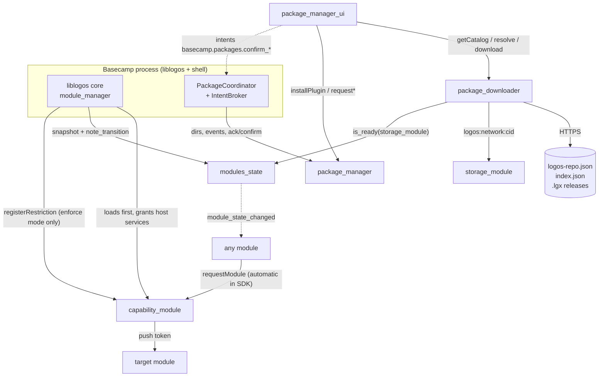

# Stack: Platform modules (bundled in Basecamp 0.3.1) + catalog utilities

**Pinned at:** Basecamp 0.3.1 (`aeb8192`); accounts_ui 0.3.0 (`026565e`), capability_module 1.0.0 (`1a1b8b5`), modules_state 0.1.0 (`ed0f4ba`), openmetrics 0.1.1 (`f8da2a0`), package_downloader 1.0.0 (`d40d4ab`), package_manager 1.0.0 (`41df424`), package_manager_ui 1.0.0 (`3174edd`).

What every Logos module runs next to. Basecamp 0.3.1 (tag `0.3.1` = `aeb8192`, 2026-10-01) bakes six
modules into the app image; this doc covers five of them plus three catalog utilities. The sixth
bundled module, `storage_module` (v3.0.0, also in the catalog), is covered in `stacks/storage.md`.

- **package_manager** installs/uninstalls `.lgx` files locally and scans what is installed.
- **package_downloader** federates catalogs (`logos-repo.json` → `index.json`), resolves
  dependencies, downloads and verifies `.lgx` files (HTTPS or Logos Storage).
- **capability_module** mints the per-(caller, target) tokens every inter-module call needs and
  holds the optional access policy.
- **modules_state** is the read-only, subscribable registry of module lifecycle state, fed by liblogos.
- **package_manager_ui** is the "Package Manager" app; it provides the `packages.show` /
  `packages.install` intents.
- Catalog utilities: **openmetrics** (Prometheus scrape endpoint), **accounts_ui** (AccountLog
  identity app with its own key vault), **json_rpc_bridge** (submodule only — not published).

Revs: bundled modules from Basecamp's 0.3.1 `flake.lock`; catalog modules from
`data/catalog-pins.tsv`. Libraries followed: `logos-package-downloader@5f394fa` (lgpd),
`logos-package-manager@3133786` (lgpm), `logos-liblogos@db45024`, `logos-protocol@8bbc027`.

## Modules

| module | type | role | holds keys? | depends on | version / rev |
|---|---|---|---|---|---|
| `package_manager` | core | local install, scan, dependency walks, gated uninstall/upgrade/install, signature policy + keyring | trusted *public* signer keys (keyring dir) | — | 1.0.0, bundled `logos-package-manager-module@41df424` |
| `package_downloader` | core (`concurrency: multi`) | repositories, merged catalog, resolve, verified download | no | optional: `storage_module`, `modules_state` | 1.0.0, bundled `logos-package-downloader-module@d40d4ab` |
| `capability_module` | core | token broker; access-policy store | per-module auth tokens (via host services) | — | 1.0.0, bundled `logos-capability-module@1a1b8b5` |
| `modules_state` | core (`concurrency: single`) | lifecycle registry + `module_state_changed` | no | — | 0.1.0, bundled `logos-modules-state-module@ed0f4ba` |
| `package_manager_ui` | ui_qml | Package Manager app | no | `package_manager`, `package_downloader` | 1.0.0, bundled `logos-package-manager-ui@3174edd` |
| `openmetrics` | core | OpenMetrics `/metrics` HTTP endpoint scraping listed modules | no | interface dep `metrics_source` | catalog 0.1.1 (`openmetrics-module@5dbca24`) |
| `accounts_ui` | ui_qml | create/import/observe Logos accounts, publish AccountLogs | **yes**: scrypt-sealed vault, one file per account | — | catalog 0.3.0 (`logos-accounts-ui@026565e`) |
| `json_rpc_bridge` | core | JSON-RPC 2.0 over HTTP/WS into chosen modules | no (optional bearer secret) | — | **not in index**; submodule `logos-json-rpc-bridge@c8135ec` (metadata 0.1.0) |

Bundled list: [flake.nix#L225-L244](https://github.com/logos-co/logos-basecamp/blob/aeb819216c1a54563d758e82fb2264359987dd2c/flake.nix#L225-L244)
(dev builds use the `installDev` bundler, release builds `installPortable`).

## Where things live (Basecamp 0.3.1)

| path | contents | source |
|---|---|---|
| `<app>/../modules`, `<app>/../plugins` | **embedded** (read-only) core modules / UI plugins — the bundled six | [LogosBasecampPaths.h#L83-L95](https://github.com/logos-co/logos-basecamp/blob/aeb819216c1a54563d758e82fb2264359987dd2c/app/utils/LogosBasecampPaths.h#L83-L95) |
| `<base>/modules`, `<base>/plugins` | **user**-installed packages | [L52-L62](https://github.com/logos-co/logos-basecamp/blob/aeb819216c1a54563d758e82fb2264359987dd2c/app/utils/LogosBasecampPaths.h#L52-L62) |
| `<base>/module_data/<module>/<instanceId>/` | each module's `instancePersistencePath()` (e.g. `repositories.json`, `lez_core` wallet files) | [app/main.cpp#L360-L361](https://github.com/logos-co/logos-basecamp/blob/aeb819216c1a54563d758e82fb2264359987dd2c/app/main.cpp#L360-L361) |
| `<base>/logs/`, `<base>/config.yaml` | session logs (module hosts' stderr included) | README |

`<base>` = Qt `AppDataLocation` (Linux `~/.local/share/Logos/LogosBasecamp`, macOS
`~/Library/Application Support/Logos/LogosBasecamp`), with `Dev` appended for non-portable
builds; `LOGOS_USER_DIR` / `--user-dir` override ([L40-L50](https://github.com/logos-co/logos-basecamp/blob/aeb819216c1a54563d758e82fb2264359987dd2c/app/utils/LogosBasecampPaths.h#L40-L50)).
Basecamp points `package_manager` at these four directories on startup
([PackageCoordinator.cpp#L121-L124](https://github.com/logos-co/logos-basecamp/blob/aeb819216c1a54563d758e82fb2264359987dd2c/app/PackageCoordinator.cpp#L121-L124)).



---

## Catalog / repository model

**Identity card** — a repository *is* the URL of its `logos-repo.json`:
`{schemaVersion, name, displayName, description, homepage, indexUrl, trustedSigners[], includesUrl?}`.
The default catalog's card ([logos-repo.json](https://github.com/logos-co/logos-modules-release/blob/3ba43d6ebeba32799e82bf728c590a775c5baf91/logos-repo.json#L1-L9)):
name `logos-modules-official`, `indexUrl`
`https://github.com/logos-co/logos-modules-release/releases/download/index/index.json`,
**`trustedSigners: []`**.

**Default repo URL is compiled into lgpd** (the library inside `package_downloader`):
`https://raw.githubusercontent.com/logos-co/logos-modules-release/refs/heads/main/logos-repo.json`
([package_downloader_lib.cpp#L58-L59](https://github.com/logos-co/logos-package-downloader/blob/5f394fa435cfea33399b730a322d8d90040b5747/src/package_downloader_lib.cpp#L58-L59)).
It is always present unless the user disables (`defaultDisabled`) or removes (`defaultRemoved`) it,
and is never written to the config ([spec.md#L77-L124](https://github.com/logos-co/logos-package-downloader/blob/5f394fa435cfea33399b730a322d8d90040b5747/docs/spec.md#L77-L124)).

**Index** (`index.json`, schemaVersion 2): `{schemaVersion, repositoryName, generatedAt,
packages: [{name, versions: [...]}]}`; each version is `{releasedAt, publisherRef, url, urls[],
size, sha256, rootHash, manifest, icon?, signature?}`. `manifest` is the package's
`manifest.json` (`name, version, type, category, main{variant: file}, dependencies, hashes{root,
variants, variants/<v>}, manifestVersion, view?, provides?…`). `urls` may add
`logos:<network>:<cid>` (17 of 104 versions in the 2026-10-01 snapshot, network `logos.dev`).
**No version in the snapshot carries a signature.**

**Publishing pipeline** (`logos-co/logos-modules-release`): each module is a git submodule; a
per-module `workflow_dispatch` builds every variant, packs `.lgx`, and creates one GitHub release
`<name>-v<version>` holding the `.lgx` and a `sidecar.json` (`builtVariants`, `missingVariants`,
`manifest`, optional `cid`/`networks`). Name and version come from the submodule's
`metadata.json` at whatever commit the submodule pointer holds *when the workflow runs*. The rolling
`index` release is regenerated on a `rebuild-index` dispatch and every 6 h
([rebuild-index.yml#L11-L24](https://github.com/logos-co/logos-modules-release/blob/3ba43d6ebeba32799e82bf728c590a775c5baf91/.github/workflows/rebuild-index.yml#L11-L24)).
The index appears to list every release that exists (the snapshot still carries
`blockchain_module` 0.0.999); a version disappears only if its GitHub release is deleted.

**Merging** ([spec.md#L125-L272](https://github.com/logos-co/logos-package-downloader/blob/5f394fa435cfea33399b730a322d8d90040b5747/docs/spec.md#L125-L272)):
per-repo failures are recorded as `resolveError` and skipped; `includesUrl` lets a catalog draw
from others (depth ≤ 4, ≤ 32 catalogs, cycle-checked); merging happens within a configured repo,
never across two; versions sort newest-first by SemVer.

**Download source** — `any` (Logos Storage first, then HTTPS; default), `logos`, or `http`;
persisted with the repositories. When `storage_module` reports ready (via
`modules_state.is_ready`), `package_downloader` itself runs `loadConfigOrDefault → init → start`
on it ([storage_fetcher_factory.cpp#L89-L160](https://github.com/logos-co/logos-package-downloader-module/blob/d40d4ab906e4e093c43c69c374ca1b6ec9e85ab8/src/storage_fetcher_factory.cpp#L89-L160), [impl.cpp#L219-L240](https://github.com/logos-co/logos-package-downloader-module/blob/d40d4ab906e4e093c43c69c374ca1b6ec9e85ab8/src/package_downloader_impl.cpp#L219-L240)).

## Install & variant model

1. **Resolve** — `resolveDependencies(depsJson, installedJson)` returns install-ordered
   `{name, version, rootHash, repositoryUrl, url, topLevel}`; an `{error, name}` entry stops the plan.
   Ranges: npm/Cargo subset (`^`, `~`, comparators, `x`, `||`) — [spec.md#L325-L391](https://github.com/logos-co/logos-package-downloader/blob/5f394fa435cfea33399b730a322d8d90040b5747/docs/spec.md#L325-L391).
   Transitive deps already satisfied on disk are omitted; top-level ones never are.
2. **Download + verify** — structure, `rootHash` vs the file's manifest root, manifest fields
   (`name, version, main, dependencies, type`), and signer DID *if advertised*. A facet with nothing
   advertised is skipped. Trust in the signer is **not** checked here
   ([spec.md#L274-L323](https://github.com/logos-co/logos-package-downloader/blob/5f394fa435cfea33399b730a322d8d90040b5747/docs/spec.md#L274-L323)).
3. **Install** — `package_manager.installPlugin(path, skipIfNotNewer, source)` extracts the variant
   matching this build, applies the signature policy (`warn` by default: unsigned installs with a
   warning; Basecamp 0.3.1 sets no policy), writes to the *user* dir, emits
   `corePluginFileInstalled` / `uiPluginFileInstalled` ([cpp#L223-L263](https://github.com/logos-co/logos-package-manager-module/blob/41df424fe04155c243db090659cef619e070a60b/src/package_manager_impl.cpp#L223-L263)).
   Basecamp reacts by rescanning; the module still has to be **loaded** before anyone can call it.

**Variants.** Package variant keys: `darwin-arm64`, `linux-amd64`, `linux-arm64`,
`windows-x86_64` (+ per-variant `main`). A **dev** build of lgpm/liblogos accepts only
`<host>-dev`; a **portable** build accepts only `<host>`
([package_manager_lib.cpp#L1434-L1456](https://github.com/logos-co/logos-package-manager/blob/3133786ea86821e251fccc82a2eefbfc4db7605e/src/package_manager_lib.cpp#L1434-L1456)).
Catalog releases are portable. Consequence: a `nix build` (dev) Basecamp cannot install catalog
packages ("Package does not contain variant for platform: linux-amd64-dev"); use a release/AppImage
build or `nix build .#lgx` locally for dev builds.

**Embedded vs user.** Embedded packages cannot be uninstalled. Upgrading one installs the new
version into the user dir, which then shadows the embedded copy in scans.

**Gated flows** (GUI only — [package_manager_impl.h#L101-L166](https://github.com/logos-co/logos-package-manager-module/blob/41df424fe04155c243db090659cef619e070a60b/src/package_manager_impl.h#L101-L166)):
`requestUninstall(name)` / `requestUpgrade(name, tag, mode 0|1|2, depChanges)` /
`requestInstall(name, tag, repoUrl, depChanges)` / `requestMultiUninstall([names])` → emit
`before*`; a listener must call `ackPendingAction(name)` within **3 s** or the module emits
`*Cancelled`. Then `confirm*` / `cancel*`. One pending action globally. Basecamp is that listener
and draws the dialog when PMU raises the `basecamp.packages.confirm_*` intents.
`resetPendingAction()` clears a stale one.

---

## Capability / permission model

**Tokens.** Every module-to-module call carries a per-(caller, target) token. The SDK fetches one
automatically on the first call: `lp_client_create` "dials `capability_module` transparently the
first time a target requires a token" ([logos_protocol.h#L427-L447](https://github.com/logos-co/logos-protocol/blob/8bbc027c99505c3c2f043265f8c1ae8ff899bdff/cpp/logos_protocol.h#L427-L447)).
`capability_module.requestModule(fromModuleName, moduleName)`:
identity is the RPC caller document (`logos::currentCaller()`; host → `"core"`), **not** the
`fromModuleName` argument, which is ignored; refuses unnamed callers, unknown targets, policy
denials and unreachable targets (returns `""`); mints a UUID and pushes it to the target with a
3 s timeout ([capability_module_impl.cpp#L60-L167](https://github.com/logos-co/logos-capability-module/blob/1a1b8b5a1167931afbf41ebaafbe76034e6357a0/src/capability_module_impl.cpp#L60-L167)).
Its two privileges come from `"host_services": ["token_registry", "token_delivery"]`, granted by the
host to this module alone ([metadata.json#L33-L36](https://github.com/logos-co/logos-capability-module/blob/1a1b8b5a1167931afbf41ebaafbe76034e6357a0/metadata.json#L33-L36)).
A token proves *who* is calling; it is not a permission.

**Access policy.** `registerRestriction(authToken, targetModule, allowedCallers)` is accepted only
with the core or capability_module token ([cpp#L169-L204](https://github.com/logos-co/logos-capability-module/blob/1a1b8b5a1167931afbf41ebaafbe76034e6357a0/src/capability_module_impl.cpp#L169-L204)).
A target with no registered restriction is **unrestricted** (fail-open, `TODO(access-policy)` at
[cpp#L117-L130](https://github.com/logos-co/logos-capability-module/blob/1a1b8b5a1167931afbf41ebaafbe76034e6357a0/src/capability_module_impl.cpp#L117-L130)).
liblogos registers restrictions only when given a policy with `"mode": "enforce"`; it then derives,
per loaded target, the allowed callers = the target's loaded dependents + `core` + `core_service`
([liblogos README#L173-L216](https://github.com/logos-co/logos-liblogos/blob/db45024f5c45ce5fc00ab76a6921985839ad7355/README.md#L173-L216)).

- **Basecamp 0.3.1 default: no policy → any loaded module may call any other**
  ([main.cpp#L363-L389](https://github.com/logos-co/logos-basecamp/blob/aeb819216c1a54563d758e82fb2264359987dd2c/app/main.cpp#L363-L389)).
- Opt in: `--access-policy enforce`, a JSON file path, or inline JSON; or env `LOGOS_ACCESS_POLICY`.
  `restrictions.<target>.allowedCallers` replaces the derived list. `ui_qml` apps are not tracked as
  dependents, so under `enforce` they are denied their own backends unless listed
  ([README#L212-L264](https://github.com/logos-co/logos-basecamp/blob/aeb819216c1a54563d758e82fb2264359987dd2c/README.md#L212-L264)).
- `capability_module`, `core`, `core_service` are never restricted as targets.
- The `capabilities` array in `metadata.json` (e.g. `["plugin_installation"]`) is descriptive: no
  enforcement of it was found in liblogos@db45024 or Basecamp 0.3.1.

**Ungated, high-impact methods** reachable by any loaded module under the default:
`package_manager.installPlugin` (installs code), `uninstallPackage`, `setSignaturePolicy("none")`,
`addTrustedKey`, `setUser*Directory`; `package_downloader.addRepository`, `setDownloadSource`.
The gated `request*` flow is a UI convention, not a security boundary.

**App-to-app intents** are a separate, Basecamp-owned mechanism for `ui_qml` apps
(`provides` / `uses` in `metadata.json`; see the Basecamp repo's `docs/app-to-app-intents.md`). A
request must be declared in the caller's `uses` as **objects** (`[{"intent": "packages.install"}]`;
a bare string array is silently ignored). PMU provides `packages.show` and `packages.install`
(both `handoff: true`; the handler reads `params.name`), answered "on arrival" — install success means "the
confirmation gate is up", not "installed" ([PackageRevealRequest.qml#L33-L46](https://github.com/logos-co/logos-package-manager-ui/blob/3174edd016f8464c6bbdb667db54d0f7b117a62c/src/qml/Panels/PackageRevealRequest.qml#L35-L45)).

---

## Module lifecycle events — `modules_state`

Contract ([modules_state_impl.h#L80-L200](https://github.com/logos-co/logos-modules-state-module/blob/ed0f4ba534520542764775efc1d0ef705a02e616/src/modules_state_impl.h#L80-L200)):

```
ModuleRecord  { module, instance?, pid?, state, reason?, path, type, version,
                dependencies: [tstr], dependents: [tstr], loadedAt: int, seq: uint }
ModuleListing { modules: [ModuleRecord], partial: bool, seq: uint }
list_modules() -> ModuleListing        module_record(module) -> ?ModuleRecord   is_ready(module) -> bool
event module_state_changed(module, instance?, pid?, old_state, new_state, reason?, seq)
```

- Record states: `unloaded`, `loading`, `loaded`, `ready`, `stopping`, `error`. Event-only:
  `absent` (discovery `absent→unloaded`, prune `unloaded→absent`). Consumers **must** treat an
  unknown state as "not loaded".
- `ready` = loaded **and** published its object. It does not mean *your* call will succeed (token
  handshake is per caller); `is_ready` turns true a few hundred ms early for that purpose.
- Replay rule: a transition applies iff its `seq` beats the stored one; `apply_snapshot` merges per
  record. `partial: true` until a snapshot arrives.
- Ingest (`note_transition`, `apply_snapshot`) accepts only `currentCaller().isHost()`.
- `instance` is stable across reloads; a changed `pid` is what tells you a module restarted.
- **Fed at Basecamp's liblogos pin**: liblogos auto-loads `modules_state` if installed, pushes a
  snapshot when it publishes, then every transition, including `ready`
  ([module_manager.cpp#L529-L546](https://github.com/logos-co/logos-liblogos/blob/db45024f5c45ce5fc00ab76a6921985839ad7355/src/logos_core/module_manager.cpp#L529-L546), [L1268-L1295](https://github.com/logos-co/logos-liblogos/blob/db45024f5c45ce5fc00ab76a6921985839ad7355/src/logos_core/module_manager.cpp#L1268-L1295)). The module's README ("nothing feeds this module", "`ready` is not reachable") is stale.
- Subscribe through the generated wrapper or `lp_subscribe` (both hold the subscription until the
  module publishes). A hand-rolled `requestObject` + `onEvent` fails if `modules_state` has not
  published yet. Events emitted before your subscription arms are not replayed — read
  `list_modules()` after subscribing.

---

## Per-module API reference

**package_manager** ([package_manager_impl.h](https://github.com/logos-co/logos-package-manager-module/blob/41df424fe04155c243db090659cef619e070a60b/src/package_manager_impl.h#L15-L201)) — returns `LogosMap`/`LogosList` JSON:
`installPlugin(path, skipIfNotNewer, source?)` → `{name, path, isCoreModule, signatureStatus,
signer*?, error?}` (success = no `error`); `inspectPackage(lgxPath)` → `{name, version, type,
rootHash, signatureStatus, isAlreadyInstalled, installedVersion?, installedDependents?, variants}`;
`uninstallPackage(name)` → `{success, error?, removedFiles?}`; `getInstalledPackages()` /
`getInstalledModules()` / `getInstalledUiPlugins()` → manifest fields + `installDir`,
`mainFilePath`, `installType: "embedded"|"user"`; `resolveDependencies|Dependents(name, recursive)`
(trees), `resolveFlatDependencies|Dependents(name, recursive)` (lists); `getValidVariants()`;
`setSignaturePolicy("none"|"warn"|"require")`, `setKeyringDirectory`, `verifyPackage`,
`add/remove/listTrustedKeys`; gated flow above. Events: `corePluginFileInstalled(path)`,
`uiPluginFileInstalled(path)` (path may be a directory for QML-only packages — rescan instead of
loading it), `corePluginUninstalled(name)`, `uiPluginUninstalled(name)`, `beforeUninstall|Upgrade|
Install|MultiUninstall(payloadJson)`, `*Cancelled(payloadJson)`, `upgradeUninstallDone`,
`installApproved({name, releaseTag, repositoryUrl})`.

**package_downloader** ([package_downloader_impl.h#L26-L139](https://github.com/logos-co/logos-package-downloader-module/blob/d40d4ab906e4e093c43c69c374ca1b6ec9e85ab8/src/package_downloader_impl.h#L26-L139)):
`addRepository(url)`, `removeRepository(url)`, `setRepositoryEnabled(url, bool)` →
`{success, error?}`; `listRepositories()` → `[{url, enabled, isDefault, name, displayName,
description, homepage, indexUrl, trustedSignerDids[], resolveError}]`; `refreshCatalog()`;
`getCatalog()` / `getCatalogForRepo(urlOrName)` → `[{repositoryUrl, repositoryName,
originRepository*, name, type, category, author, description, icon, versions[]}]` (versions carry
`sourceAvailable`/`sourceUnavailableReason`); `getDownloadSource()` / `setDownloadSource(any|logos|http)`;
`downloadPinned(repo, name, version, rootHash)` → `{name, path, source?, error?}` (empty = any);
`resolveDependencies(depsJson, installedJson)`; `downloadResolvedDependencies(depsJson,
installedJson)` → `[{name, path, error?}]`. Events: `catalogChanged()`,
`downloadProgress(name, received, total)` (`total` 0 = unknown), `downloadDone(name, source)`.
Downloaded files go to the system temp dir (the module passes an empty output dir,
[impl.cpp#L93-L95](https://github.com/logos-co/logos-package-downloader-module/blob/d40d4ab906e4e093c43c69c374ca1b6ec9e85ab8/src/package_downloader_impl.cpp#L93-L95)). Repo config: `<instance>/repositories.json`
([impl.cpp#L177-L199](https://github.com/logos-co/logos-package-downloader-module/blob/d40d4ab906e4e093c43c69c374ca1b6ec9e85ab8/src/package_downloader_impl.cpp#L177-L199)).

**capability_module**: `requestModule(from, target) -> tstr`, `registerRestriction(token, target,
[callers]) -> bool`. No events. The committed `src/capability_module.lidl` is dead (contract is
generated from the header).

**package_manager_ui**: no callable API for other modules (UI plugin); reach it via intents
`packages.show` / `packages.install` ([metadata.json#L16-L31](https://github.com/logos-co/logos-package-manager-ui/blob/3174edd016f8464c6bbdb667db54d0f7b117a62c/metadata.json#L16-L31)).
It previews transitive changes before any download and owns the "install with dependencies" prompt.

**openmetrics** ([openmetrics_impl.h#L36-L67](https://github.com/logos-co/openmetrics-module/blob/5dbca2441ce478a6373df924cc4abd79640e74db/src/openmetrics_impl.h#L36-L67)):
`start(configJson) -> int` (1 ok), config `{"port": 9090, "modules": ["name" | {"name", "format":
"data"|"text"}]}`; `stop()`, `getInfo()`, `scrape()`. To be scraped, a module implements
`LogosMap collectMetrics()` → `{"metrics": [{name, type, help, value, labels?}]}` or
`std::string collectOpenMetricsText()` ([metrics_source.h#L20-L34](https://github.com/logos-co/openmetrics-module/blob/5dbca2441ce478a6373df924cc4abd79640e74db/interfaces/metrics_source.h#L20-L34)).
It only scrapes modules named in `start`; no discovery. The HTTP daemon is started without a bind
address, i.e. on all interfaces, unauthenticated ([openmetrics_impl.cpp#L94-L98](https://github.com/logos-co/openmetrics-module/blob/5dbca2441ce478a6373df924cc4abd79640e74db/src/openmetrics_impl.cpp#L94-L98)).

**accounts_ui**: a `ui_qml` app with its Rust core (`logos_account_core`) linked into the UI
plugin; no core module, no `provides`, so other modules cannot call it. Keys live in
`module_data/accounts_ui/vault`, one scrypt-sealed file per account (`LOGOS_ACCOUNTS_VAULT_DIR`
overrides). Publishes AccountLogs over HTTP to `https://devnet.chat-kc.logos.co/v1/account/{address}`
([store.rs#L22](https://github.com/logos-co/logos-accounts-ui/blob/026565ee83587368ed07f64a6614bde2663f8869/rust-core/src/store.rs#L22); `LOGOS_ACCOUNTS_STORE_URL` overrides, `memory` = in-process). Published logs are permanent.

**json_rpc_bridge**: start-time config `{http: {host: 127.0.0.1 (non-loopback refused), port: 8645,
allowed_origins}, auth: {mode: none|bearer}, expose: {modules: [...]}}`; JSON-RPC `rpc.call`,
`<module>.<method>` aliases, `rpc.subscribe`, OpenRPC/OpenAPI/AsyncAPI discovery. Every call runs
with the bridge's own authority (README: "a confused deputy by construction"). Release runs
succeeded on 2026-09-10 and 09-17 (the latter re-pointed tag `json_rpc_bridge-v0.1.0`), but that
release and tag no longer exist and the index has no entry. Not installable from the catalog;
reason unverified.

---

## Querying these from another module or a script

- **Universal C++ module** (declare the dependency so the typed client is generated):
  `modules().package_downloader.getCatalog()`, `modules().modules_state.is_ready("lez_core")`.
- **Qt UI backend**: `LogosModules logos(api); logos.package_manager.getInstalledModules();`
  `logos.modules_state.on("module_state_changed", cb)`.
- **C ABI (Nim/Rust/C)**: `lp_client* c = lp_client_create("modules_state", "my_module", NULL, NULL);`
  `lp_invoke(c, "list_modules", "[]", 5000, &res, &err);`
  `lp_subscribe(c, "module_state_changed", cb, ud)` — `data_json` is the event's argument array
  ([logos_protocol.h#L380-L531](https://github.com/logos-co/logos-protocol/blob/8bbc027c99505c3c2f043265f8c1ae8ff899bdff/cpp/logos_protocol.h#L380-L531)).
- **ui_qml app (QML)**: `logos.request("packages.install", {name: "lez_core"}, cb)` with
  `"uses": [{"intent": "packages.install"}]`.
- **Headless daemon**: `logoscore call package_downloader getCatalog`,
  `logoscore call modules_state list_modules`, `logoscore watch modules_state --event
  module_state_changed` (retry if it answers `WATCH_FAILED`; an empty optional is `'json:null'`).
- **CLIs without a runtime**: `lgpd list|search|info|download` (catalog), `lgpm --modules-dir …
  install --file x.lgx | list | deps | dependents` (local).
- **Raw catalog**: `curl -sL https://github.com/logos-co/logos-modules-release/releases/download/index/index.json`.

## Config & persistence

| module | persisted | where |
|---|---|---|
| package_downloader | `repositories.json` `{schemaVersion, defaultDisabled, defaultRemoved, followIncludes, downloadSource, repositories:[{url, enabled}]}` | `<instance>/`; XDG `~/.config/logos/package-downloader/` outside a host |
| package_manager | installed packages; trusted keys | user dirs; keyring default `~/.config/logos/trusted-keys/` |
| capability_module | nothing (tokens + restrictions in memory, re-registered each boot) | — |
| modules_state | nothing (rebuilt from the host snapshot) | — |
| openmetrics | nothing; config passed to `start` | — |
| accounts_ui | vault files | `module_data/accounts_ui/vault` |

## Gotchas & open questions

- **Signatures are inert today**: no catalog version is signed, `trustedSigners` is empty, and the
  policy is `warn`. Integrity rests on HTTPS + GitHub releases + `rootHash` binding of file to index.
- **Everything installs code**: with no access policy, any loaded module can `installPlugin` an
  arbitrary `.lgx` or add a repository. Assume a malicious module is game over for the session.
- **Dev vs portable variants** silently partition the world (see Install & variant model).
- **Unknown method → `null`**, not an error, on every transport ([logos_protocol.h#L484-L497](https://github.com/logos-co/logos-protocol/blob/8bbc027c99505c3c2f043265f8c1ae8ff899bdff/cpp/logos_protocol.h#L484-L497));
  `modules_state.module_record` also answers `null` for "not known". Check the method exists.
- **3 s ack window**: a headless caller of `requestUninstall` with no listener always gets
  `uninstallCancelled`; scripts should use `uninstallPackage`.
- **First call races the token push**; the capability push has a 3 s timeout, so calling out from
  your own initializer to a module that has not published can fail fast with `""`.
- `package_downloader` starts the Logos Storage node on its own when `storage_module` is ready;
  whether Basecamp loads `storage_module` at startup by default is unverified.
- `logos-modules-release` has a `release-logos-accounts-module.yml` workflow but no
  `accounts_module` submodule or index entry; `accounts_module` (referenced by liblogos/Basecamp
  access-policy examples) is not in the default catalog.
- The catalog is mutable history: a release built while a submodule pointer was wrong stays in the
  index (e.g. `logos_execution_zone` 1.0.0, see `stacks/blockchain-lez.md`).
