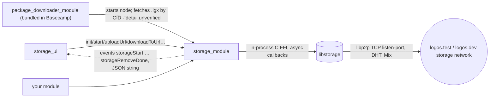

# Storage stack

**Pinned at:** storage_module 3.0.0 (`a9c14b8`), storage_ui 3.0.0 (`63e9cb1`); Basecamp 0.3.1
(`aeb8192`).

Scope: Logos Basecamp 0.3.1 (2026-10-01). `storage_module` 3.0.0 is **bundled** in Basecamp
(flake input `logos-storage-module` v3.0.0, consumed by the bundled package downloader —
[basecamp flake.nix L37-L38](https://github.com/logos-co/logos-basecamp/blob/aeb819216c1a54563d758e82fb2264359987dd2c/flake.nix#L37-L38))
and is also in the default catalog at the same version; `storage_ui` 3.0.0 comes from the
catalog. Sources read at the commits in `data/catalog-pins.tsv`; links are commit-pinned.
"Unverified" = read in code/docs, not exercised at runtime.

## Summary

`storage_module` is a C++ "universal" Logos module wrapping `libstorage` (C API built from
`logos-storage-nim`, the Codex lineage). It runs one content-addressed p2p storage node per
Logos Core host: upload a file → get a CID (`zDvZ…`); anyone on the same network downloads by
CID, which also replicates it. Lifecycle is `init(cfg)` → `start()` → … → `stop()` →
`destroy()`; uploads, downloads, manifest fetches and removals complete asynchronously through
nine events whose single argument is a JSON string. Mix (privacy routing for DHT lookups and
downloads) is built in. Config and data live under **`$HOME/.logos_storage/`**, not the host's
per-instance directory, and the node is shared: Basecamp's package downloader starts it, and
`storage_ui` attaches to that node. The catalog's `urls` include entries of the form
`logos:logos.dev:zDvZ…` next to the GitHub URL, which appear to be storage CIDs on `logos.dev`
used by the downloader (resolution path unverified — the downloader repo was not read).

## Modules

| module | type / interface | role | depends on | catalog version | pinned source |
|---|---|---|---|---|---|
| [`storage_module`](../modules/storage_module/README.md) | core / universal (C++ header codegen; `impl_header: storage_module_plugin.h`) | libstorage node: upload/download by CID, manifests, quota, Mix | none (ships `libstorage.{so,dylib,dll}`) | 3.0.0 (also bundled) | logos-storage-module `a9c14b8` (tag v3.0.0) |
| [`storage_ui`](../modules/storage_ui/README.md) | ui_qml (C++ `StorageBackend` + QML, `.rep`) | file-sharing app: onboarding, upload, fetch manifest, download, delete | `storage_module` | 3.0.0 | logos-storage-ui `63e9cb1` (tag v3.0.0) |

Platforms: darwin-arm64, linux-amd64, linux-arm64, windows-x86_64 for both. Repos carry a
`CLAUDE.md` ([storage-module](https://github.com/logos-co/logos-storage-module/blob/a9c14b8c977da51310361b03fe4d9efd763ae926/CLAUDE.md),
[storage-ui](https://github.com/logos-co/logos-storage-ui/blob/63e9cb1755e48bd36bc0e29192e8c861ebf02fb6/CLAUDE.md))
and Sphinx docs ([docs/index.rst](https://github.com/logos-co/logos-storage-module/blob/a9c14b8c977da51310361b03fe4d9efd763ae926/docs/index.rst)).

## Dependency / call direction

## API (generated contract)

From `nix build github:logos-co/logos-storage-module/a9c14b8c977da51310361b03fe4d9efd763ae926#lidl`;
doc comments in [storage_module_plugin.h](https://github.com/logos-co/logos-storage-module/blob/a9c14b8c977da51310361b03fe4d9efd763ae926/src/storage_module_plugin.h).

| group | methods | sync? |
|---|---|---|
| config | `loadConfigOrDefault() -> result` (JSON string) | sync |
| lifecycle | `init(cfg: tstr) -> bool`, `start() -> bool`, `stop() -> result`, `destroy() -> result`, `isRunning() -> bool` | init sync; start/stop async (events) |
| info | `libstorageVersion()`, `moduleVersion() -> tstr`, `dataDir()`, `network()`, `peerId()`, `spr()`, `debug()`, `collectMetrics() -> {tstr:any}`, `updateLogLevel(level)` | sync |
| peers | `connect(peerId: tstr, peerAddresses: [tstr]) -> result` | async → `storageConnect` |
| upload | `uploadUrl(filePath, chunkSize: int, advertise: bool)` → sessionId; manual: `uploadInit(filename, chunkSize, advertise)` → sessionId, `uploadChunk(sessionId, chunk: tstr)`, `uploadFinalize(sessionId)` → **CID**, `uploadCancel(sessionId)` | uploadUrl/uploadChunk async |
| download | `downloadManifest(cid, isPrivate, advertise)`; `downloadToUrl(cid, filePath, local, chunkSize, isPrivate, advertise)` → sessionId (= cid); `downloadChunks(cid, local, chunkSize, isPrivate, advertise)`; `downloadCancel(sessionId)` | async |
| data mgmt | `exists(cid)` → bool; `fetch(cid, isPrivate, advertise)` (background, **no completion event**); `remove(cid)` → `storageRemoveDone`; `manifests()` → `[{cid, treeCid, datasetSize, blockSize, filename, mimetype}]`; `space()` → `{totalBlocks, quotaMaxBytes, quotaUsedBytes, quotaReservedBytes}`; `getAdvertise(cid)`, `setAdvertise(cid, bool)` | remove async, rest sync |
| headless | `importFiles(path)` — `uploadUrl` for each regular file, no return | fire-and-forget |

Return convention: `init`/`start`/`isRunning` return a bare `bool` (no error string — reasons
only on the module's stderr); everything else `StdLogosResult {success, value, error}`
([CLAUDE.md](https://github.com/logos-co/logos-storage-module/blob/a9c14b8c977da51310361b03fe4d9efd763ae926/CLAUDE.md)).
Default `chunkSize` is 65536.

## Key flows

**Node lifecycle** ([plugin.h L28-L144](https://github.com/logos-co/logos-storage-module/blob/a9c14b8c977da51310361b03fe4d9efd763ae926/src/storage_module_plugin.h#L28-L144)):
1. `cfg = loadConfigOrDefault()` — saved config migrated to `config-version` 3, or a default.
2. `init(cfg)` — creates the libstorage context; **once per context** (a second call returns
   `false`, [cpp L824-L874](https://github.com/logos-co/logos-storage-module/blob/a9c14b8c977da51310361b03fe4d9efd763ae926/src/storage_module_plugin.cpp#L824-L874)).
   On success the config is written to `~/.logos_storage/config.json`.
3. `start()` → event `storageStart {success, message}`. Already running → succeeds and emits
   immediately; starting/stopping → returns `false` ([cpp L876-L931](https://github.com/logos-co/logos-storage-module/blob/a9c14b8c977da51310361b03fe4d9efd763ae926/src/storage_module_plugin.cpp#L876-L931)).
4. `stop()` → `storageStop {success, message}`; can restart. `destroy()` frees the context —
   stop first (destroy on a running node is documented as undefined behaviour). To apply a new
   config: `stop` → `destroy` → `init(newCfg)` → `start`. `aboutToUnload` stops and destroys on
   module unload.

**Upload (file)**: `uploadUrl("/abs/path", 65536, true)` → sessionId; events
`storageUploadProgress {success, sessionId, bytes, total}` (≤ 1 per percent) then
`storageUploadDone {success, sessionId, cid | error}`. The path is opened by the
storage_module process, so it must be readable there (absolute path).

**Upload (stream)**: `uploadInit(filename, chunkSize, advertise)` → sessionId; repeat
`uploadChunk(sessionId, chunk)` (one `storageUploadProgress` per chunk; a failed chunk does not
cancel the session); `uploadFinalize(sessionId)` returns the CID synchronously.

**Download**: optional `downloadManifest(cid, isPrivate, advertise)` →
`storageDownloadManifestDone {success, cid, manifest{manifestVersion, treeCid, datasetSize,
blockSize, filename, mimetype} | error}` (async since 2.0.0); then
`downloadToUrl(cid, "/abs/dest", local=false, 65536, isPrivate, advertise)` →
`storageDownloadProgress {success, sessionId, bytes, total}` … `storageDownloadDone {success,
sessionId, error?}`. `downloadChunks` instead streams `storageDownloadProgress {chunk: <base64>}`
per chunk (not throttled). `local=true` reads only the local repo.

**CIDs**: manifest CID like `zDvZRwzm…` (what you share); `treeCid` like `zDzS…`. A download
replicates the dataset and (with `advertise=true`) serves it onward.

All event payloads: one `tstr` holding JSON ([plugin.h L440-L545](https://github.com/logos-co/logos-storage-module/blob/a9c14b8c977da51310361b03fe4d9efd763ae926/src/storage_module_plugin.h#L440-L545));
parse `data[0]`.

## Events

| event | payload (JSON string) | emitted by |
|---|---|---|
| `storageStart` / `storageStop` | `{success, message}` | `start` / `stop` |
| `storageConnect` | `{success, message}` | `connect` |
| `storageUploadProgress` | `{success, sessionId, bytes?, total, error?}` | `uploadUrl`, `uploadChunk` |
| `storageUploadDone` | `{success, sessionId, cid?, error?}` | `uploadUrl` |
| `storageDownloadProgress` | `{success:true, sessionId, bytes, total}` or `{…, chunk: base64}` | `downloadToUrl` / `downloadChunks` |
| `storageDownloadDone` | `{success, sessionId, error?}` | both downloads |
| `storageDownloadManifestDone` | `{success, cid, manifest?, error?}` | `downloadManifest` |
| `storageRemoveDone` | `{success, cid, error?}` | `remove` |

Events are host-wide: any subscriber sees every session's events, including those started by the
package downloader or `storage_ui`. Correlate by `sessionId` / `cid`.

## Configuration & presets

`init` takes a JSON object; every key optional (full example in
[plugin.h L41-L99](https://github.com/logos-co/logos-storage-module/blob/a9c14b8c977da51310361b03fe4d9efd763ae926/src/storage_module_plugin.h#L41-L99);
names mirror `conf.nim` in logos-storage-nim, the source of truth per CLAUDE.md).

| key | default | notes |
|---|---|---|
| `network` | `logos.test` | presets `logos.test`, `logos.dev`, `codex.dev` (deprecated); any `bootstrap-node` overrides ([index.rst L145-L175](https://github.com/logos-co/logos-storage-module/blob/a9c14b8c977da51310361b03fe4d9efd763ae926/docs/index.rst#L145-L175)) |
| `bootstrap-node` / `no-bootstrap-node` | `[]` / `false` | own network: first node `no-bootstrap-node: true`, others bootstrap from its `spr()` |
| `data-dir` | module fills `$HOME/.logos_storage/data` when absent | docs table still says `.cache/storage` — the code wins ([cpp L791-L812](https://github.com/logos-co/logos-storage-module/blob/a9c14b8c977da51310361b03fe4d9efd763ae926/src/storage_module_plugin.cpp#L791-L812)) |
| `listen-port` | `0` (random) | TCP; also carries peer discovery since config v3 (no UDP disc port) |
| `nat` | `auto` | or `extip:<IP>`; legacy values are dropped on migration |
| `storage-quota` | 21474836480 (20 GiB) | |
| `mix-enabled` | `false` per docs; `true` from `loadConfigOrDefault()` | see below |
| `dht-mix-proxy`, `mix-pool`, `mix-pool-json` | filled from preset when Mix on | per-network relay lists compiled in from [mix-config.json](https://github.com/logos-co/logos-storage-module/blob/a9c14b8c977da51310361b03fe4d9efd763ae926/mix-config.json) |
| `log-level`, `log-file`, `metrics*`, `max-peers`, `block-ttl` (30d), `nat-*` tuning | see header | `nat-schedule-interval` migrated to `60s` |

Mix: when `mix-enabled` is true and no custom bootstrap is set, `init`/`loadConfigOrDefault`
overwrite `dht-mix-proxy` + `mix-pool-json` from the network preset
([cpp L764-L789](https://github.com/logos-co/logos-storage-module/blob/a9c14b8c977da51310361b03fe4d9efd763ae926/src/storage_module_plugin.cpp#L764-L789)).
`isPrivate=true` tunnels downloads/DHT lookups over Mix (KB/s speeds); full privacy also needs
`advertise=false` ([index.rst L276-L330](https://github.com/logos-co/logos-storage-module/blob/a9c14b8c977da51310361b03fe4d9efd763ae926/docs/index.rst#L276-L330)).
Reading of the migration code: a missing config file migrates `{}` from version 0, which sets
`mix-enabled: true` and `nat-schedule-interval: "60s"`, so `loadConfigOrDefault()` with no saved
file returns Mix on with `logos.test` relays (code-derived, unverified at runtime).

## Persistence

- `~/.logos_storage/config.json` — last successful `init` config (`HOME`, or `USERPROFILE` on
  Windows) ([cpp L567-L629](https://github.com/logos-co/logos-storage-module/blob/a9c14b8c977da51310361b03fe4d9efd763ae926/src/storage_module_plugin.cpp#L567-L629)).
- `~/.logos_storage/data` — default block repository (`repo-kind: fs`).
- Both are per OS user, **not** per Logos instance: Basecamp, `logoscore`, and standalone apps on
  one account share them unless the caller passes `data-dir` (config.json is always shared).
  Behaviour with two live nodes on one `data-dir` is unverified.
- The plugin and `libstorage` must sit in the same directory (`@loader_path` linkage).

## storage_ui

Backend contract [StorageBackend.rep](https://github.com/logos-co/logos-storage-ui/blob/63e9cb1755e48bd36bc0e29192e8c861ebf02fb6/src/StorageBackend.rep):
slots `init(configJson)`, `start/stop/destroy`, `uploadFile(QUrl)`, `downloadFile(cid, QUrl,
totalBytes, isPrivate)`, `downloadManifest(cid, isPrivate)`, `downloadManifests()`, `exists`,
`remove`, `fetch`, `refreshSpace`, `updateUserConfig/getUserConfig`, debug loggers; props
`status` (Stopped/Starting/Running/Stopping/Destroyed), `natReachability`, `mixRunning`.
Defaults it shows ([StorageBackend.cpp L670-L682](https://github.com/logos-co/logos-storage-ui/blob/63e9cb1755e48bd36bc0e29192e8c861ebf02fb6/src/StorageBackend.cpp#L670-L682)):
`data-dir ~/.logos_storage/data`, `listen-port 8500`, `nat-schedule-interval 60s`,
`mix-enabled true`. Uploads use `uploadUrl(path, 65536, advertise=true)`; downloads pass
`advertise = !isPrivate`.

Attach logic ([L79-L130](https://github.com/logos-co/logos-storage-ui/blob/63e9cb1755e48bd36bc0e29192e8c861ebf02fb6/src/StorageBackend.cpp#L79-L130),
[L299-L345](https://github.com/logos-co/logos-storage-ui/blob/63e9cb1755e48bd36bc0e29192e8c861ebf02fb6/src/StorageBackend.cpp#L299-L345)):
`init()` returning false while `libstorageVersion().success` is true means "a node another
consumer (the package downloader) already initialised" → attach; `isRunning()` true → treat as
started. On `storageStop` success it immediately calls `destroy()`
([L160-L188](https://github.com/logos-co/logos-storage-ui/blob/63e9cb1755e48bd36bc0e29192e8c861ebf02fb6/src/StorageBackend.cpp#L160-L188)).

## Using storage_module from another module

1. `metadata.json`: `"dependencies": ["storage_module"]`; add a flake input **named**
   `storage_module` (the builder resolves a dependency's contract from the same-named input; see
   `stacks/messaging.md` step 2 for the pattern). In Basecamp the module is already present
   (bundled); outside Basecamp it must be installed.
2. Subscribe before acting: C++ `m_logos->storage_module.on("storageUploadDone", { auto j = QJsonDocument::fromJson(d[0].toString().toUtf8()).object(); })`
   — same for the other eight events; register once (storage_ui guards with a flag).
3. Attach-or-create: `if (!storage_module.isRunning()) { if (!init(loadConfigOrDefault().value)
   && !libstorageVersion().success) fail; start(); /* wait storageStart */ }`. Treat `init == false`
   + live context as "someone else owns it".
4. Never `stop()`/`destroy()` a node you did not create — in Basecamp that is the package
   downloader's node.
5. Upload with `uploadUrl(absPath, 65536, true)` and take the CID from `storageUploadDone`
   matched on `sessionId`; or `uploadInit`/`uploadChunk`/`uploadFinalize` for in-memory data.
6. Download with `downloadManifest` (optional, gives size/filename) then `downloadToUrl`; match
   `storageDownloadDone.sessionId == cid`. Use `exists(cid)` / `local=true` for cache hits.
7. Long calls (`downloadManifest`, `remove`) are async by design; do not block a UI thread on
   events — hop to your own thread before calling back into the module (same rule as delivery).

## Gotchas & open questions

- Shared global state: one node per host plus one `~/.logos_storage` per OS user. Your config is
  ignored if the downloader already ran `init`; your `init` rewrites `config.json` for everyone.
- `storage_ui` "Stop" destroys the shared context; whether that breaks a later package download
  until restart is unverified.
- `uploadChunk(sessionId, chunk: tstr)` declares the chunk as text in the contract; whether
  arbitrary binary survives IPC intact is unverified — prefer `uploadUrl` for binary data.
- `fetch` has no completion event; poll `exists(cid)`.
- `init`/`start` return bare `bool`; read the module's stderr / host log for the reason.
- `storage_ui/docs/ui-guide.md` still tells users to forward UDP `9090` for discovery
  ([L9](https://github.com/logos-co/logos-storage-ui/blob/63e9cb1755e48bd36bc0e29192e8c861ebf02fb6/docs/ui-guide.md#L9));
  config v3 removed the discovery UDP port (`disc-port` dropped on migration,
  [cpp L734-L739](https://github.com/logos-co/logos-storage-module/blob/a9c14b8c977da51310361b03fe4d9efd763ae926/src/storage_module_plugin.cpp#L734-L739)).
  Only TCP `listen-port` matters.
- Basecamp 0.3.1's commit title says "pin logos-storage-module to 0.3.0 (#454)" but the flake pins
  `v3.0.0`; the flake is authoritative.
- Open: how the downloader turns catalog `logos:logos.dev:<CID>` URLs into downloads (network
  choice, fallback to the GitHub URL) — read `logos-package-downloader-module` to confirm.
